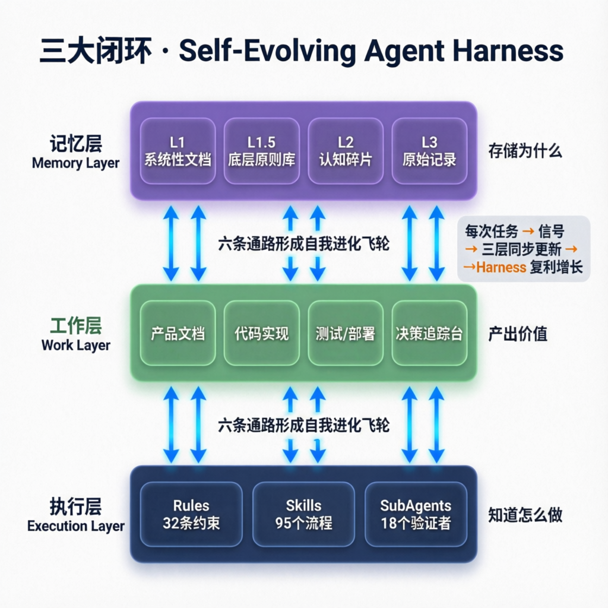
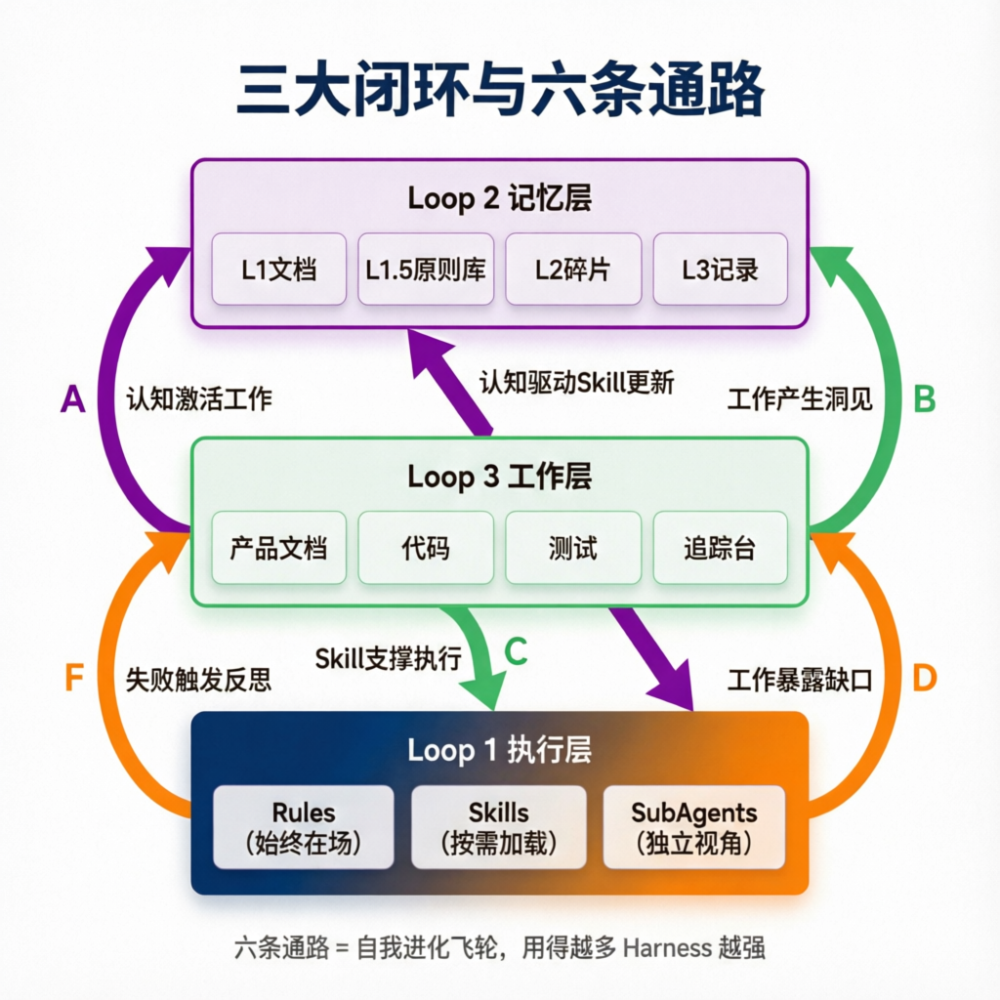
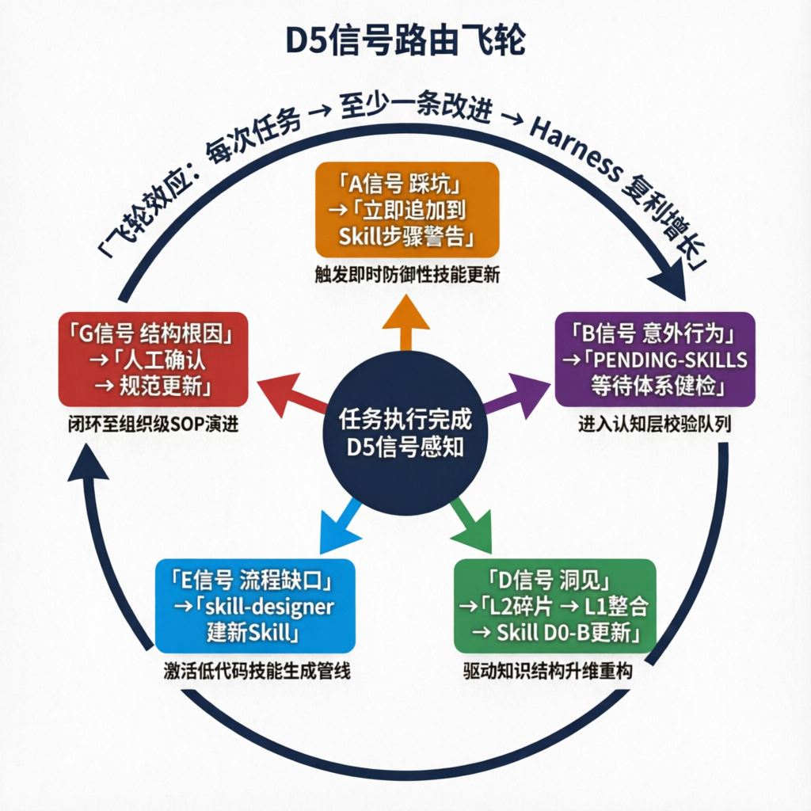
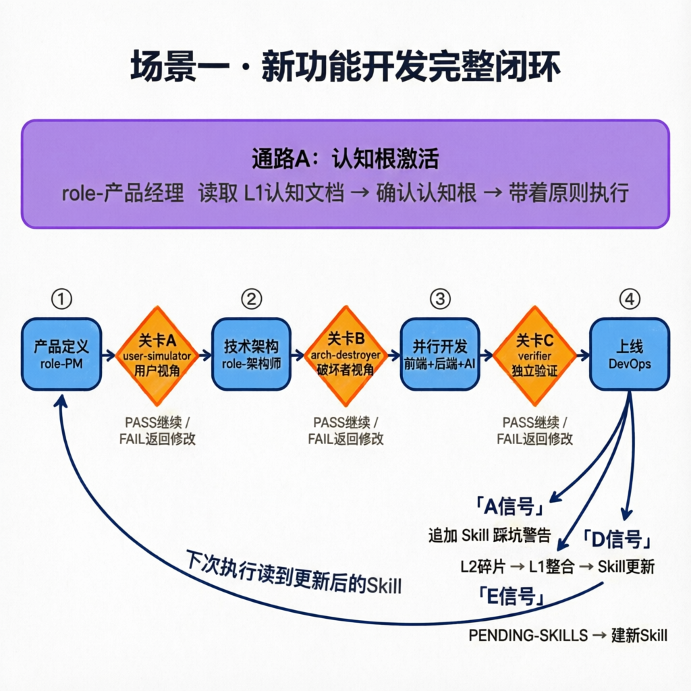
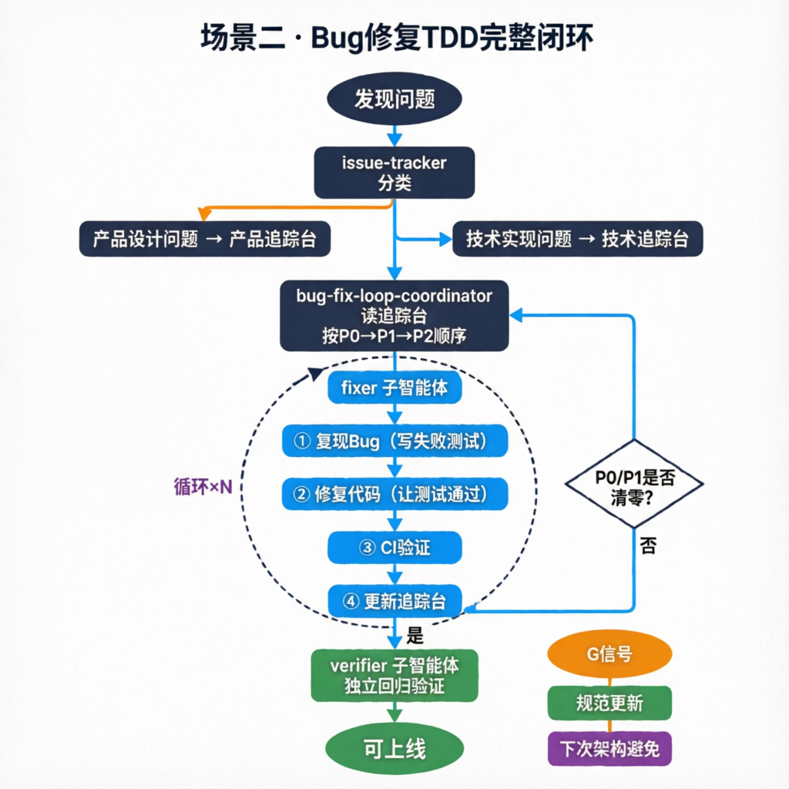
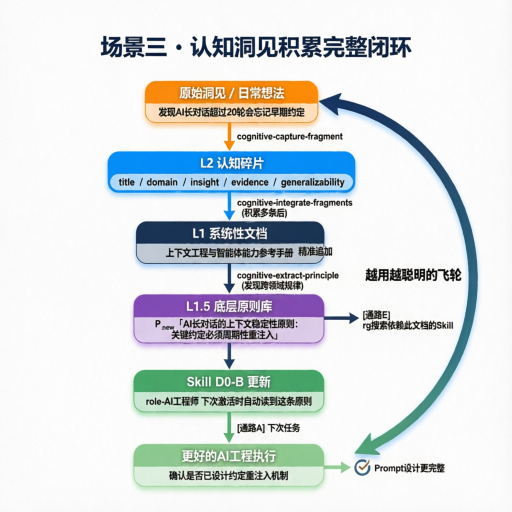
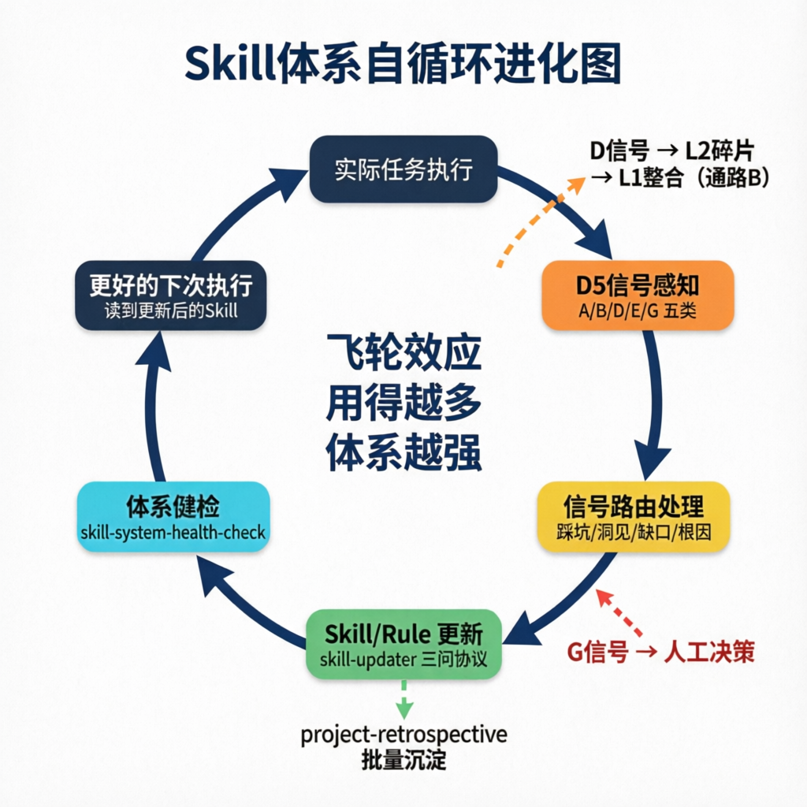

<!-- Logo -->
<p align="center">
  <a href="https://tashan.ac.cn" target="_blank" rel="noopener noreferrer">
    
  </a>
</p>

<!-- 标题 -->
<p align="center">
  <strong>他山 Cursor Skill 体系</strong><br>
  <em>Tashan Cursor Skill System — Self-Evolving Agent Harness</em>
</p>

<!-- 快速导航 -->
<p align="center">
  <a href="#什么是-agent-harness">什么是 Harness</a> •
  <a href="#我们的-harness-有什么不同">我们的不同</a> •
  <a href="#三大闭环架构">三大闭环</a> •
  <a href="#自我进化飞轮">进化飞轮</a> •
  <a href="#三个完整闭环场景">场景示例</a> •
  <a href="#认知体系的构建与更新">认知体系</a> •
  <a href="#skill-体系的自循环">Skill自循环</a> •
  <a href="#完整-skill-速查">Skill 速查</a> •
  <a href="#安装方式">安装</a> •
  <a href="README.en.md">English</a>
</p>

[](https://opensource.org/licenses/MIT)
[](#完整-skill-速查)
[](#安装方式)
[](#完整-skill-速查)

---

## 什么是 Agent Harness

> **模型是马力，套具是方向。The model is commodity. The harness is moat.**

2026 年，大模型能力已趋于饱和——对于代码生成、文档撰写、分析推理等大多数任务，主流模型之间的差距已非瓶颈。真正的差距在于你围绕模型构建的**执行套具（Agent Harness）**。

Harness 是包裹在模型外层的运行时治理层，它决定：该调用什么工具、该验证什么输出、该记住什么上下文、该在什么条件下停止。没有 harness，模型只是一匹强壮但方向不定的马；有了 harness，马力才能转化为可靠、可控、可预期的工作。

<p align="center">
  
</p>

---

## 这套 Harness 是如何构建的

这套体系围绕一个核心机制构建：**执行中涌现的经验，自动更新 Harness 本身。**

每次任务完成后，`session-bootstrap` Rule 强制执行 D5 信号感知：踩坑变成 Skill 步骤警告，洞见变成认知碎片，流程空白变成待建的新 Skill。三层结构同步更新，下一次执行就是在更完善的 Harness 上运行。

Harness 由三层构成，六条通路把它们连接成自我进化的整体：

---

## 三大闭环架构

整套体系由三个相互连接的闭环构成，六条通路让它们形成自我进化的整体：

<p align="center">
  
</p>

**六条通路说明：**

| 通路 | 方向 | 触发机制 | 效果 |
|---|---|---|---|
| **A** | Loop2 → Loop3 | 任务开始，读取认知根（D0-B） | 用方法论指导当次任务，而非凭感觉 |
| **B** | Loop3 → Loop2 | D信号（洞见）→ cognitive-capture-fragment | 工作洞见沉淀为认知碎片 |
| **C** | Loop1 → Loop3 | Skill 版本更新后，下次读取新版 | 上次沉淀的经验，这次自动应用 |
| **D** | Loop3 → Loop1 | E信号（缺口）→ PENDING-SKILLS | 工作中发现缺少某类能力 → 建新 Skill |
| **E** | Loop2 → Loop1 | L1文档更新后，Grep 找依赖 Skill → 更新 D0-B | 认知进化驱动 Skill 方法论同步 |
| **F** | Loop1 → Loop2 | B信号重复3次 → 认知层反思 | 持续失败模式触发方法论层面的重审 |

---

## 自我进化飞轮

每次任务完成后，`session-bootstrap` Rule 强制执行 D5 信号感知，将执行结果路由到对应的更新通道：

<p align="center">
  
</p>

**五类信号及其处置：**

| 信号 | 触发条件 | 自动处置 |
|---|---|---|
| **A** 踩坑 | 出现预期外失败 / 已知问题再次发生 | 立即追加到对应 Skill 步骤的警告区 |
| **B** 意外行为 | Skill 未按预期执行 | 记录到 PENDING-SKILLS，等 skill-system-health-check 处理 |
| **D** 洞见 | 发现有价值的新认知 | cognitive-capture-fragment → L2 碎片 → 定期整合进 L1 |
| **E** 流程缺口 | 发现缺少某类执行能力 | PENDING-SKILLS → skill-designer 建新 Skill |
| **G** 结构性根因 | 某问题第3次出现，根因是架构/规范缺陷 | PENDING-PROPOSALS [HUMAN-REQUIRED] → 人工确认 → 规范更新 |

---

## 三个完整闭环场景

### 场景一：开发一个新功能

**产出物：**

| 产出物 | 文件 | 类型 |
|---|---|---|
| 产品规格 | 产品定义.md（含功能状态表） | K4 K-object |
| 技术方案 | 技术架构.md + decision-log 追加 | K4 K-object |
| 实现代码 | 代码文件 | 实现产物 |
| 验收报告 | 测试报告.md | S1* 审计对象 |
| 关卡报告 | 关卡A/B/C审核报告.md | S1* 只读审计 |

**完整闭环：**

```
[开始前：通路A — 认知根激活]
role-产品经理 Step D0：
  读取「AI时代产品设计原则」（L1认知文档）
  确认认知根：「本次产品设计基于 §三：闭环完整性原则」

[执行阶段]
产品定义 → [关卡A：user-simulator 独立视角] → 技术架构
         → [关卡B：arch-destroyer 破坏者视角] → 并行开发
         → [关卡C：verifier 独立验证] → 上线

[任务完成后：D5信号自动路由]
  A信号（踩坑）→ 追加到 role-后端开发 Skill 踩坑速查
  D信号（洞见）→ L2碎片 → 整合进「AI架构参考.md」→ 更新 Skill D0-B
  E信号（缺口）→ PENDING-SKILLS → skill-designer 建新 Skill
```

<p align="center">
  
</p>

**这个场景的闭环价值**：第1次做功能时踩坑的 Redis 用法，自动变成了第2次的「架构师最佳实践」，不需要人工记录和传递。

---

### 场景二：修复一个 Bug

**产出物：**

| 产出物 | 文件 | 类型 |
|---|---|---|
| Bug记录 | bug-log.md（追加） | S-object，只追加 |
| 修复代码 | 代码文件 | 实现产物 |
| 追踪台更新 | 技术问题追踪台.md | K4 K-object |
| 工程原则（若有） | 研发规范.md 或 Skill 步骤 | K3 K-object 或 B-object |

**完整闭环：**

```
[开始前：通路A]
fixer 子智能体 Step D0：
  读取产品定义.md → 「确认：修复必须符合产品意图，不能只图技术方便」
  [product-alignment-guard Rule 强制执行]

[执行阶段：TDD修复循环]
issue-tracker 分类 → P0/P1 技术Bug
bug-fix-loop-coordinator 读追踪台 → dispatch fixer
  循环：
    fixer → Step1: 写失败测试（先确认能复现）
           → Step2: 修复代码（让测试通过）
           → Step3: CI 验证
           → Step4: 更新追踪台状态
  → verifier 独立回归验证

[任务完成后：D5信号分流]
  A信号（踩坑）→ 追加到 role-DevOps Skill 踩坑速查
  G信号（结构性根因）→ PENDING-PROPOSALS [人工确认] → 研发规范.md 更新
                     → [通路E] 通知依赖此规范的 Skill 重新对齐
```

<p align="center">
  
</p>

**这个场景的闭环价值**：同类 Bug 的第3次出现变成了架构规范的一部分，第4次在设计阶段就被拦截。

---

### 场景三：积累一个认知洞见

**产出物：**

| 产出物 | 文件 | 类型 |
|---|---|---|
| 认知碎片 | L2_碎片化思考/xxx.md | L2 K-object |
| 系统性文档更新 | L1_系统性文档/xxx.md | L1 K-object |
| 底层原则 | L1.5_底层原则库.md | L1.5 K-object |
| Skill方法论更新 | D0-B 摘要（嵌入 Skill system prompt） | B-object |

**完整闭环：**

```
你说：「记录一下，我发现当用户和AI的多轮对话超过20轮时，
       AI对早期约定的记忆会显著衰减，需要在Prompt里加上关键约定的摘要」

[捕捉]
cognitive-capture-fragment → 结构化 L2 碎片：
  title: "长对话的关键约定摘要机制"
  domain: "AI工程/上下文工程"
  evidence: "tashan-openbrain 实测，2026-03-25"

[整合]
cognitive-integrate-fragments → 整合进「上下文工程与智能体能力参考手册.md」

[原则提炼]
cognitive-extract-principle → P_new：
  「AI长对话的上下文稳定性原则：关键约定必须周期性重注入」

[通路E：认知→Skill对齐]
rg "上下文工程" .cursor/skills/ → 找到 role-AI工程师
PENDING-SKILLS 追加 → project-retrospective 处理 → D0-B 更新

[通路A：新认知激活新工作]
下次 role-AI工程师 任务：
  读取更新后的 D0-B → 「确认是否已设计约定重注入机制」
  → 更完整的 Prompt 设计，减少长对话质量下降
```

<p align="center">
  
</p>

**这个场景的闭环价值**：一次实践踩坑 → L2碎片 → L1整合 → L1.5原则 → Skill D0-B → 下次任务自动带着这个认知，形成「越用越聪明」的飞轮。

---

## 认知体系的构建与更新

认知体系（Loop 2）是整套体系的「认知根」层，有 7 种构建和更新模式：

### 模式一：日常碎片捕捉

**触发：** 「记录一下 / 有个洞见 / 我发现」

```
[cognitive-capture-fragment]
输入：原始想法（一句话到一段话）
输出：结构化 L2 碎片（含 title/domain/insight/evidence/generalizability）
时机：随时，不需要积累，立即执行
```

### 模式二：碎片整合

**触发：** 「整合碎片 / 哪些碎片没整合 / 处理积压」

```
[cognitive-integrate-fragments]
输入：多条同域 L2 碎片 + 对应的 L1 文档
输出：L1 文档更新（精准追加，非重写）+ history/ 备份
机制：「小人机制」—— 以L1文档居民视角判断碎片放在哪个章节
```

### 模式三：原则提炼

**触发：** 「这些碎片有共性 / 提炼一下规律 / 有什么底层逻辑」

```
[cognitive-extract-principle]
输入：多条指向同一规律的碎片
输出：L1.5 底层原则（需用户确认后写入）
价值：将具体经验升华为可跨场景应用的规律
```

### 模式四：受控知识更新

**触发：** 「更新[文档名] / 在[文档]里加上XXX」

```
[cognitive-update-knowledge]
输入：明确的修改意图 + 目标 L1 文档
输出：L1 文档更新 + 自动备份 + 一致性验证 + 变更记录
安全机制：修改前备份，[cognitive-verifier] 子智能体独立验证自洽性
```

### 模式五：系统重组

**触发：** 「系统整理 / 认知结构乱了 / 全量梳理」

```
[cognitive-reorganize]
输入：全工作区文档
输出：文档归属建议 + 分类路由方案（按三大闭环框架）
时机：文档散乱后的大扫除，或新启动一个认知维度时
```

### 模式六：一致性检查

**触发：** 「一致性检查 / 自洽验证 / 跑一遍验证」

```
[cognitive-consistency-check]
输入：认知结构全量文档
输出：C1-C10 一致性报告（矛盾列表 + 建议修复方案）
定期执行，防止认知文档随时间产生内部矛盾
```

### 模式七：矛盾检测

**触发：** 「[文档A]和[文档B]是否一致 / 检查矛盾」

```
[cognitive-detect-contradiction]
输入：两份或多份 L1 文档
输出：矛盾点列表 + 基于 L1.5 原则的消解方案
```

---

## Skill 体系的自循环

Skill 体系不只是工具集，它本身也是一个能自我进化的系统。

### 单次经验 → Skill 更新

```
任何任务完成后，D5信号自动路由：

A信号（踩坑）──────────────→ 立即追加到对应 Skill 步骤（B-object Level 1修改）
B信号（Skill意外行为）──────→ PENDING-SKILLS，等 skill-system-health-check 处理
E信号（流程缺口）──────────→ PENDING-SKILLS，后续 skill-designer 建新 Skill
G信号（结构性根因）────────→ PENDING-PROPOSALS [HUMAN-REQUIRED]，人工确认后修规范

手动触发：
「踩坑了/经验值得记」──────→ [skill-capture-closure]
                               判断：修改已有Skill / 新建Skill / 记录原则
                               执行：三问协议 + 备份 + 变更记录
```

### 项目级批量复盘

```
「项目做完了/批量复盘」──────→ [project-retrospective]
                               扫描本次所有用到的 Skills
                               逐个判断：是否需要更新？
                               批量调用 [skill-updater 子智能体] 执行更新
                               输出：复盘报告 + 更新清单
```

### 体系健康检查

```
定期或发现异常时：
[skill-system-health-check]
  → 检查：触发词冲突 / 孤立组件 / 版本漂移 / Rule叠加矛盾
  → 输出：健康报告

[skill-domain-health-check]
  → 检查某个域（如「产品开发」）的传播完备性
  → 任意入口是否能到达正确终态

[skill-domain-self-optimizer]
  → 基于健康报告，生成定向修复方案
  → 新Skill提案 / 现有Skill修改 / 触发链补全
```

### Skill 体系战略演进

```
[skill-evolution-planner-meta]
  输入：CO-BUILD-LOG（决策轨迹）+ PENDING-EXPERIENCES + PENDING-SKILLS
  输出：体系演进路线图（哪些Skill需新建/合并/拆分/废弃）

[expert-bootstrap]
  按需为新领域培养专家Agent（调研→自问自答→专家配置）
  输出：可复用的领域专家 B-object（Agent定义文件）
```

<p align="center">
  
</p>

---

## 用户工作流指南

### 工作流一：开发新功能

**触发：** 「做一个XXX功能」「新需求：用户要能XXX」

```
你说需求
  │
  ▼ [自动识别：新功能任务]
[role-产品开发协调者] 规划执行序列
  │
  ▼ [1. 产品设计阶段]
[role-产品经理] → 输出：产品定义.md + 功能状态表
  │
  ▼ [关卡A：独立审核，clean context]
[role-审核者-用户模拟 + user-simulator 子智能体]
  → PASS → 产品定义冻结
  → NEEDS-REVISION → 返回 PM 修改
  │
  ▼ [2. 技术架构阶段]
[role-技术架构师] → 输出：技术架构.md + 接口规范
  │
  ▼ [关卡B：独立审核]
[role-审核者-系统破坏 + arch-destroyer 子智能体]
  → PASS → 架构冻结，开发启动
  │
  ▼ [3. 并行开发阶段]
[test-env-setup] 准备测试环境
[role-前端开发] + [role-后端开发] + [role-AI工程师] 并行实现
  │
  ▼ [关卡C：独立验证]
[role-测试工程师 + verifier 子智能体]
  → PASS → 可上线
  │
  ▼ [4. 上线阶段]
[role-DevOps] → 部署 + 验证 + 监控配置
  │
  ▼ [5. 自动收尾]
D5 信号路由：踩坑 → Skill 更新 / 洞见 → 认知碎片 / 缺口 → PENDING-SKILLS
```

---

### 工作流二：修复 Bug

**触发：** 「登录接口报500」「这个功能不对」「发现了bug」

```
你描述问题
  │
  ▼
[issue-tracker] 分类：产品设计问题 or 技术实现问题
  │
  ▼
[bug-fix-loop-coordinator] 读追踪台，规划修复顺序
  │
  循环 × N：
  ▼
  [fixer 子智能体] TDD 修复流程：
    1. 复现 Bug（写失败测试）
    2. 修复代码（让测试通过）
    3. 运行 CI
    4. 更新追踪台（P0/P1 是否清零？）
  │
  ▼ [所有 P0/P1 清零]
[verifier 子智能体] 独立回归验证
```

---

### 工作流三：收集和处理外部反馈

**触发：** 「记录这几个待办」「先存到待办文档」「处理项目待办」

```
[模式A：收集]
你说「有几个反馈/需求/问题，先记下来」
  │
  ▼
[project-backlog] Inbox 模式
  → 所有类型的信息都追加到「项目待办.md」
  → 不即时处理，积累后批量处理

[模式B：处理]
你说「处理项目待办/按待办文档修复」
  │
  ▼
[project-backlog] 处理模式
  → 逐条分类：技术Bug / UX问题 / 新功能 / 建议
  → 自动路由到对应工作流
  → 生成批次处理报告
```

---

### 工作流四：接手新代码库

**触发：** 「读一下这个项目」「理解这个代码库」「接手项目」

```
你指向代码库
  │
  ▼
[codebase-explorer] 全量扫描
  → 目录结构 → 核心模块 → 依赖关系 → 数据流
  → 与已有产品定义/文档对比（如有）
  → 输出：架构理解文档（可读的技术全景）
```

---

### 工作流五：内容创作

**触发：** 「写一篇技术文章」「帮我写公众号推文」「调研一下XXX」

```
[调研]      → [research-output] → 图文 Markdown → 注册到知识库
[公众号文章] → [wechat-article-writer] → 内容 → HTML → 配图 → 审稿
[技术文章]  → [general-article-writer] → 大纲 → 正文 → 审稿 → 格式
[审稿]      → [article-proofreading] → AI腔/标题/结语检查
```

---

### 工作流六：系统自我进化

```
任务执行中出现问题
  │
  ▼ [D5 信号自动路由，任务完成后]
  ├── A信号（踩坑）→ 立即追加到对应 Skill 步骤的警告
  ├── B信号（意外行为）→ PENDING-SKILLS.md
  ├── D信号（洞见）→ [cognitive-capture-fragment] → L2 认知碎片
  ├── E信号（流程缺口）→ PENDING-SKILLS.md
  └── G信号（结构性根因）→ PENDING-PROPOSALS.md [人工确认]

[project-retrospective] 项目完成后批量处理
  → 归纳共性 → 更新 Skills/Rules
  → [skill-updater 子智能体] 执行实际更新（三问协议 + 备份）
```

---

### 工作流七：认知积累

```
日常记录想法：「记录一下 / 我发现 / 有个洞见」
  → [cognitive-capture-fragment] → L2 碎片

整合碎片：「整合碎片 / 哪些碎片没整合」
  → [cognitive-integrate-fragments] → 合并进 L1 文档

提炼原则：「这些碎片有没有共性 / 提炼一下规律」
  → [cognitive-extract-principle] → L1.5 底层原则库

每日汇报：「今天有什么 / 同步状态」
  → [cognitive-daily-briefing] → 认知状态快照 + 积压提醒

按你的认知文档回答问题：「基于我的文档 / 我之前怎么想的」
  → [cognitive-ask] → 带引用、置信度、矛盾的回答
```

---

### 工作流八：按需培养领域专家

**触发：** 「需要一个并发性能专家」「这个任务需要安全审查专家」

```
「需要X领域的专家 / 我们没有X方面的专家」
  │
  ▼
[expert-bootstrap] 四阶段专家培养：
  Phase 1：调研（WebSearch + 内部知识库 + 项目代码）
  Phase 2：对标整理（最佳实践 vs 项目现状差距表）
  Phase 3：自问自答反思（生成10+资深从业者视角的问题，自己回答）
  Phase 4：专家配置输出（压缩为D0-B → 写入 Agent 定义文件）
  │
  ▼
产出：可被直接 dispatch 的专家 Agent（.cursor/agents/xxx-expert.md）
```

---

## 完整 Skill 速查

### 一、产品开发全链路

| Skill / Agent | 触发方式 | 做什么 |
|---|---|---|
| **role-产品开发协调者** | 「新项目/做个功能/有个bug/全量测试」 | 识别任务类型，规划执行序列，不执行具体任务 |
| **role-产品经理** | 「产品/需求/用户流/MVP/产品定义」 | 产品定义 + 开发计划，含关卡A前置检查 |
| **role-技术架构师** | 「技术架构/系统设计/接口规范/技术选型」 | 技术方案 + 接口规范，关卡B前 |
| **role-前端开发** | 「前端/React/TypeScript/Vite/UI实现」 | React+TS 实现，含接口联调 |
| **role-后端开发** | 「后端/FastAPI/Python/API接口/PostgreSQL」 | FastAPI 后端实现，含 DB 集成测试 |
| **role-AI工程师** | 「AI/LLM/Prompt/上下文工程/RAG/智能体」 | Prompt 设计 + Agent 构建 + 效果评测 |
| **role-UI设计师** | 「设计/UI/UX/交互设计/体验感/视觉」 | UX/视觉设计 + 组件规范 |
| **role-测试工程师** | 「测试/验收/Bug报告/关卡C/闭环测试」 | 关卡C：全量功能验证 + 人工验收清单 |
| **role-DevOps** | 「部署/上线/CI-CD/服务器/Docker/nginx」 | 部署 + 运维 + 监控配置 |
| **role-数据分析师** | 「数据分析/指标/用户行为/产品健康度报告」 | 上线后指标分析 + 断裂节点识别 |

### 二、质量关卡（独立视角，readonly + clean context）

| Agent | 调用方 | 做什么 |
|---|---|---|
| **user-simulator** | role-审核者-用户模拟（关卡A） | 以挑剔用户视角走核心路径，找设计漏洞 |
| **arch-destroyer** | role-审核者-系统破坏（关卡B） | 以黑客视角找安全漏洞、性能瓶颈、架构缺陷 |
| **verifier** | role-测试工程师（关卡C） | 独立验证实现是否真正完成，避免自我确认偏差 |
| **ux-reviewer** | role-UI设计师 | 以陌生用户视角审查 UI/UX 体验 |
| **ai-evaluator** | role-AI工程师 | 独立评测 LLM 调用链效果 |

### 三、Bug 修复闭环

| Skill / Agent | 触发方式 | 做什么 |
|---|---|---|
| **issue-tracker** | 「有个问题/发现bug/这里不对/用不了」 | 将问题分类拆解，分别写入产品/技术追踪台 |
| **bug-fix-loop-coordinator** | 「全自动修复/按Bug清单修复/循环修复」 | 读追踪台 → dispatch fixer × N → 回归 → 收敛 |
| **fixer（Agent）** | bug-fix-loop-coordinator 调用 / 「spawn fixer」 | TDD 修复循环：复现→失败测试→修复→CI→追踪台 |
| **test-env-setup** | 「准备测试环境/环境预检/测试前准备」 | 启动服务、数据库、账号配置 |

### 四、外部反馈管理

| Skill | 触发方式 | 做什么 |
|---|---|---|
| **project-backlog** | 收集：「先记到待办/存到待办文档」<br>处理：「处理项目待办/按待办文档修复」 | 统一 Inbox：收集所有类型反馈，激活时分类路由处理 |

### 五、代码库 & 架构分析

| Skill | 触发方式 | 做什么 |
|---|---|---|
| **codebase-explorer** | 「阅读XXX项目/理解代码库/接手项目」 | 扫描架构，与文档对比，输出架构理解文档 |
| **architecture-gap-mapper** | 「对比XXX和YYY/找差距/竞品分析」 | 兼容/冲突/缺失三类差距报告，带代码证据 |

### 六、系统自我进化

| Skill / Agent | 触发方式 | 做什么 |
|---|---|---|
| **skill-capture-closure** | 「踩坑了/经验值得记/做个复盘/总结经验」 | 单次经验沉淀：修改或新建 Skill/Rule/知识 |
| **project-retrospective** | 「项目做完了/更新Skill/批量复盘」 | 批量复盘：扫描用到的所有 Skill，逐个沉淀 |
| **skill-updater（Agent）** | project-retrospective 调用 | 执行单条经验更新（备份+三问+变更记录） |
| **engineering-principle-recorder** | 「立一个原则/以后都要XXX/记下这条规则」 | 将原则记录到正确执行层（Skill/Rule/约束文档） |
| **expert-bootstrap** | 「需要X领域专家/培养专家/没有X方面专家」 | 调研→自问自答反思→产出专家 Agent 定义文件 |

### 七、内容创作

| Skill | 触发方式 | 做什么 |
|---|---|---|
| **research-output** | 「调研/研究/系统了解/深度研究XXX」 | 系统调研 → 图文 Markdown → 注册知识库 |
| **wechat-article-writer** | 「写公众号文章/他山推文」 | 内容 → HTML排版 → 配图 → 底部模板 → 审稿 |
| **general-article-writer** | 「写技术文章/对外分享/通用长文」 | Markdown 长文 + 审稿闭环 |
| **document-pipeline** | 「写一篇/有初稿/帮我配图/转HTML」 | 全阶段写作流水线，可从任意阶段入场 |
| **article-proofreading** | 「审稿/检查这篇文章/review一下」 | 检查 AI 腔/标题/绝对表达/结语 |

### 八、认知积累

| Skill / Agent | 触发方式 | 做什么 |
|---|---|---|
| **cognitive-capture-fragment** | 「记录一下/有个洞见/我发现/随手记」 | 捕捉 L2 认知碎片，结构化保存 |
| **cognitive-integrate-fragments** | 「整合碎片/处理积压/消化碎片」 | 碎片整合进 L1 系统性文档 |
| **cognitive-extract-principle** | 「提炼原则/这些碎片有共性吗/总结规律」 | 跨领域模式提炼为 L1.5 底层原则 |
| **cognitive-update-knowledge** | 「更新[文档名]/完善[文档名]」 | 受控 L1 文档更新（备份+验证+级联） |
| **cognitive-ask** | 「基于我的文档/我之前怎么想的/从我的角度」 | 按你的认知文档回答（带引用和置信度） |
| **cognitive-daily-briefing** | 「今天有什么/同步状态/今日简报」 | 认知系统状态快照 + 积压提醒 |
| **cognitive-review-brain-map** | 「大脑地图/认知状态/看一下状态」 | 全景认知结构图，帮助确定今日优先级 |
| **cognitive-self-reflect** | 「反思/我注意到我有个习惯/我又犯了」 | 结构化自我反思，记录到反思日志 |
| **cognitive-detect-contradiction** | 「矛盾/不一致/检查一致性」 | 找 L1 文档内部/之间的矛盾，提出消解方案 |
| **cognitive-consistency-check** | 「一致性检查/自洽检查/验证认知结构」 | 运行 C1-C10 完整一致性验证 |
| **cognitive-input-classifier** | 「帮我判断这是认知更新还是任务执行/先分类」 | 路由分类器：认知更新路径 vs 任务执行路径 |
| **cognitive-verifier（Agent）** | cognitive-update-knowledge 调用 | 独立验证 L1 文档更新的自洽性 |
| **cognitive-fragment-integrator（Agent）** | cognitive-integrate-fragments 调用（≥5碎片） | 从 L1 居民视角生成精确整合方案 |
| **cognitive-task-reflector（Agent）** | write-task-log 完成后自动调用 | 从任务日志中萃取认知价值，生成 L2 碎片候选 |
| **cognitive-cascade-notifier（Agent）** | 原则确认/L1重大更新后自动调用 | 后台分析工作节点，写入对齐待办 |

### 九、健康检查与系统维护

| Skill | 触发方式 | 做什么 |
|---|---|---|
| **three-loop-health-check** | 「三大闭环健康/全系统健康报告/整体状态」 | 三大闭环仪表盘（积压/沙盘/覆盖率） |
| **skill-system-health-check** | 「检查Skill体系/Skill健康/自检」 | Skill/Rule/Agent 内部一致性审计 |
| **project-closeout** | 「项目收尾/做收尾检查/确保文档自洽」 | 多角色文档审查 + 对话历史追踪 |
| **project-convention-resolver** | 「这里有个规范问题/这不符合规范」 | 规范偏差分类 → 路由执行修复 → 验证 |
| **role-pm-auditor（Agent）** | project-closeout 调用 | 只读审查产品定义的完整性和一致性 |
| **role-arch-auditor（Agent）** | project-closeout 调用 | 只读审查技术架构与产品定义的对齐 |
| **role-dev-auditor（Agent）** | project-closeout 调用 | 只读审查开发计划与实际完成情况的对齐 |
| **product-evolution-planner** | 「产品还缺什么/迭代建议/从原则看产品」 | 对照产品原则，识别缺口，生成战略建议 |
| **product-launch-validator** | 「新项目立项/立项前检查/兼容性检查」 | 立项前验证与三大闭环的兼容性 |

### 十、Skill 体系设计与进化（元层）

| Skill / Agent | 触发方式 | 做什么 |
|---|---|---|
| **skill-rule-修改规范** | 「修改Skill/修改Rule/修改Agent/规范修改」 | 修改任何 .cursor 组件的强制协议（三问+备份） |
| **skill-designer** | 「新建Skill/设计一个Skill/写个Agent」 | 端到端 Skill/Rule/Agent 设计，含双视角审核 |
| **skill-evolution-planner-meta** | 「Skill体系怎么演进/有没有新Skill要建」 | 基于历史数据规划 Skill 体系演进方向 |
| **skill-simulator（Agent）** | skill-designer 关卡A | 模拟第一次接触的 AI 执行者，找歧义和缺失分支 |
| **skill-system-destroyer（Agent）** | skill-designer 关卡B | 找新 Skill/Rule 与现有体系的冲突 |
| **skill-updater（Agent）** | project-retrospective | 执行单条更新（备份+三问+变更记录+索引更新） |
| **history-auditor** | 「审查历史对话/分析做过什么/找可沉淀的Skill」 | 挖掘对话历史中的重复模式和 Skill 升级候选 |
| **cross-project-coordinator** | 「多项目并行/建协调框架/几个项目同时做」 | 生成跨项目协调框架（项目地图/API契约/并行轨道） |

### 十一、数字分身（研究者画像管理）

| Skill | 触发方式 | 做什么 |
|---|---|---|
| **collect-basic-info** | 「建立画像/收集基础信息」 | 采集研究阶段、学科、方法等基础字段 |
| **administer-ams** | 「AMS/学术动机量表」 | 施测 AMS-GSR 28题（动机测量） |
| **administer-mini-ipip** | 「人格/大五人格/Mini-IPIP」 | 施测 Mini-IPIP 20题（大五人格） |
| **administer-rcss** | 「RCSS/认知风格量表/认知偏好」 | 施测 RCSS 认知风格量表 |
| **infer-profile-dimensions** | 「推断画像/快速估算/不想填量表」 | 无需量表，基于对话推断画像维度 |
| **update-profile** | 「修改画像/更新画像/补充」 | 精准更新特定字段 |
| **review-profile** | 「查看画像/确认画像」 | 完整画像审查工作流 |
| **generate-forum-profile** | 「生成论坛分身/数字分身/导出档案」 | 导出四节式论坛分身 Markdown |

---

## 自动化说明：为什么「说一句话」就能做完

整套体系的自动化来自三层协作：

**第一层：Rule（始终在场的约束，每次对话自动注入）**

- `session-bootstrap`：定义了每次对话的「序列A（任务开始前）」和「序列B（任务完成后）」——D5 信号可以自动路由
- `role-menu`：定义了所有触发词路由规则——说「做一个功能」就能启动协调者
- `comprehensive-change-guard`：多层变更时强制按序执行——关卡顺序不会乱

**第二层：Skill（按需加载的执行步骤）**

- 触发词命中，对应 SKILL.md 被读入 context，AI 按步骤执行
- 每个 Skill 定义了完整的前置条件、步骤序列、完成标准

**第三层：SubAgent（独立 context 的视角隔离验证）**

- 所有关卡（A/B/C）都使用独立 SubAgent，`readonly=true`，看不到创作者的推理过程
- 保证「审核者不被创作者视角污染」

---

## 安装方式

### 方式一：`ai-agent-skills` CLI（推荐，一行命令）

```bash
# 安装到当前项目
npx ai-agent-skills install TashanGKD/tashan-cursor-skills

# 或安装到全局（所有项目可用）
npx ai-agent-skills install --global TashanGKD/tashan-cursor-skills
```

### 方式二：Cursor 内置 GitHub 导入

1. 打开 Cursor 设置（`Cmd+Shift+J`）
2. 进入 **Rules** → **Add Rule** → **Remote Rule (Github)**
3. 输入：`https://github.com/TashanGKD/tashan-cursor-skills`
4. 重启 Cursor

### 方式三：手动复制（完全控制）

```bash
git clone https://github.com/TashanGKD/tashan-cursor-skills.git

cp -r tashan-cursor-skills/skills/* your-project/.cursor/skills/
cp -r tashan-cursor-skills/rules/* your-project/.cursor/rules/
cp -r tashan-cursor-skills/agents/* your-project/.cursor/agents/
```

重启 Cursor，所有 Skill 和 Rule 自动生效。

### 方式四：发布到他山世界 Skill 专区（维护者）

本仓库提供 **合集入口** 用的 `SKILL.md` 正文（`docs/world-publish/tashan-cursor-skills-bundle.SKILL.md`），通过 `topiclab skills publish` 上传到他山世界。执行规范见 **topiclab-world-openclaw**（CLI 优先、`session ensure`、上传前可先 `notifications list`）。

```bash
# 需已安装 topiclab-cli，并设置绑定密钥（勿写入公开仓库）
export TOPICLAB_BIND_KEY='你的_tlOS_绑定密钥'

./scripts/publish-to-tashan-world.sh
```

若 `--category development` 被 API 拒绝，运行 `topiclab help ask "skills publish category 合法取值" --json` 后修改脚本中的 `--category` 再试。后续版本迭代可用 `topiclab skills version <skill_id> --version ... --content-file ... --json`。

---

## 代码结构

```
tashan-cursor-skills/
├── README.md / README.en.md       # 中英文说明
├── CHANGELOG.md                   # 版本记录
├── CONTRIBUTING.md                # 贡献指南
├── docs/
│   ├── assets/
│   │   ├── tashan.svg                  # 他山 Logo
│   │   ├── harness-architecture.png    # Harness 架构全景图
│   │   ├── three-loop-pathways.png     # 三大闭环与六条通路
│   │   ├── signal-flywheel.png         # 自我进化飞轮图
│   │   ├── scenario1-new-feature.png   # 场景：新功能开发闭环
│   │   ├── scenario2-bug-fix.png       # 场景：Bug修复TDD闭环
│   │   ├── scenario3-cognitive.png     # 场景：认知洞见积累闭环
│   │   └── skill-self-loop.png         # Skill体系自循环图
│   ├── overview.md                # 完整系统说明
│   ├── world-publish/             # 他山世界 Skill 专区发布用正文
│   └── Skill体系设计原则_v1.0.md  # 设计哲学
├── scripts/
│   └── publish-to-tashan-world.sh # topiclab 一键发布脚本
├── skills/                        # 95 个 Skills
│   ├── role-*/                    # 角色类 Skills
│   ├── cognitive-*/               # 认知积累类 Skills
│   ├── bug-fix-loop-coordinator/  # Bug 修复协调
│   ├── skill-index/               # 体系索引
│   └── ...
├── rules/                         # 32 个 Rules（.mdc，自动注入 system prompt）
│   ├── session-bootstrap.mdc      # ★ 核心：每次对话执行协议
│   ├── role-menu.mdc              # ★ 核心：触发词路由表
│   ├── bug-fix-tdd-guard.mdc      # 强制 TDD 修复流程
│   └── ...
└── agents/                        # 18 个 SubAgents（独立 context 验证）
    ├── verifier.md / fixer.md     # 关卡验证 + 修复执行
    ├── user-simulator.md / arch-destroyer.md  # 关卡A/B
    └── cognitive-*.md             # 认知处理子智能体
```

---

## 生态位置

```
他山生态
├── Resonnet / tashan-openbrain   ← 多智能体认知协作平台
├── Tashan-TopicLab               ← 多专家圆桌讨论
├── tashan-cursor-skills ★       ← 本仓库：自我进化的 Agent Harness
└── world-axiom-framework         ← 数字世界公理框架（理论基础）
```

### 相关仓库

| 仓库 | 定位 | 链接 |
|---|---|---|
| Resonnet | 多智能体认知协作后端 | [TashanGKD/Resonnet](https://github.com/TashanGKD/Resonnet) |
| Tashan-TopicLab | 多专家圆桌讨论平台 | [TashanGKD/Tashan-TopicLab](https://github.com/TashanGKD/Tashan-TopicLab) |
| world-axiom-framework | 数字世界公理框架 | [TashanGKD/world-axiom-framework](https://github.com/TashanGKD/world-axiom-framework) |

---

## 贡献

详见 CONTRIBUTING.md。修改任何 Skill/Rule/Agent 前，必须先读 `skills/skill-rule-修改规范/SKILL.md`（三问协议）。

---

## 更新日志

见 CHANGELOG.md。

---

## 许可证

MIT License. See LICENSE for details.
