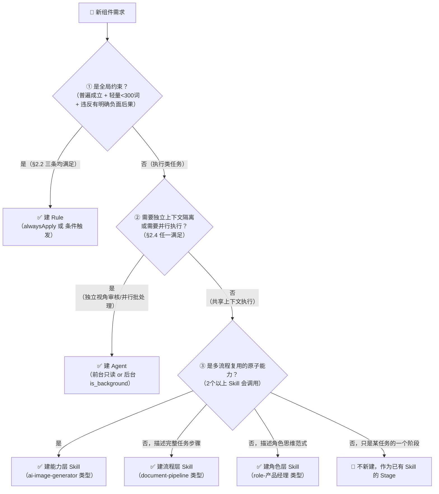
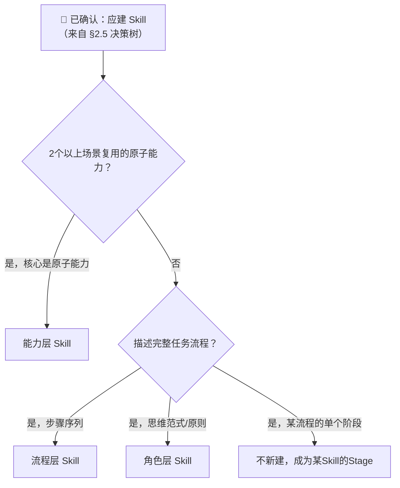

# Skill体系设计原则 v1.0

> **文档类型**：L1 系统性文档（系统架构思维维度）
> **日期**：2026-03-20
> **状态**：v1.0（基于 F-023~F-042 全量碎片提炼 + 代码级体系审计 + 沙盘推演通过）
> **归因**：🔵 郑博元系统性洞见（2026-03-20 全天深度讨论）+ 🟢 AI整理与操作化
> **关联文档**：
>   - 外部依据：`技术架构思维维度/知识库/AI智能体编排最佳实践_调研_20260320.md`（REF-EXT）
>   - 事实基础：`.cursor/skills/skill-index/skill-system-inventory-20260320.md`
>   - 操作规范：`.cursor/skills/skill-rule-修改规范/SKILL.md`
>   - 体系索引：`.cursor/skills/skill-index/SKILL-INDEX.md`
>   - 形式化规格：`_内部总控/skill-system-design/DOMAIN-REGISTRY.md`

---

## 零、阅读前提：视角声明

**本文档采用 AI 自主视角，而非用户工具视角。**

Skill 体系是 AI Agent 的内部能力系统，不是用户操作的工具界面。评价设计好坏的标准，不是「用户容不容易用」，而是「AI 能不能自主运用并从运用中学习」。

凡本文档涉及「体系」「系统」「能力」，都指 AI 自主管理和进化的行为规范结构，而非由人工维护的工具集合。（F-037）

---

## 一、唯一最终原则——系统的自我进化能力

**这是本文档所有原则的元框架。所有具体设计标准，都从这条元原则推导而来。**

### 1.1 核心命题（F-036）

> Skill 体系的设计质量，由它能否自我进化来衡量。
>
> 不是由「有多少 Skill」「规范多详细」「三层是否清晰」来判断。

「自我进化」意味着系统能够：
1. **感知自身失败**：执行中自动检测踩坑和偏差，无需人工逐一报告
2. **归纳失败模式**：多次类似失败被识别为共因，不是逐条修补而是根治
3. **自动改进规范**：识别出问题后，通过规范化流程更新 Skill/Rule，留痕可追溯
4. **验证改进有效**：下次执行时能检验修复是否真正奏效
5. **路由越来越准**：AI 越来越能自主判断任务类型，不依赖用户触发词

**当前实现**：

| 标志 | 当前实现机制 |
|---|---|
| 感知失败 | auto-experience-hook Signal A-F（6类信号自动捕捉）|
| 归纳模式 | project-retrospective 共性分析 + PENDING-EXPERIENCES 积压队列 |
| 改进规范 | skill-updater Agent + skill-rule-修改规范（三问+备份+变更记录）|
| 验证改进 | skill-system-health-check（六维自洽性检查）|
| 路由更准 | role-menu 规则13（强制前置拦截，当前态）→ AI 自主路由（目标态）|

### 1.2 评判任何设计决策的唯一标准

> **「这个设计选择，让系统更容易自我进化，还是更难？」**

以下所有章节的原则，都从这个元标准推导：
- 第2章（三者本质）→ 清晰的层级让 AI 精确感知「是哪层出了问题」
- 第3章（三层架构）→ 能力可复用，进化收益传播到所有角色
- 第4章（文档体系）→ 知识分层，Skill 越薄越易于改进
- 第5章（级联进化）→ 冲突触发反思，矛盾成为进化的燃料
- 第7-9章（设计标准）→ 防止「进化变难」的体量膨胀和结构腐烂
- 第10章（健康标准）→ 提供可量化的进化进度测量
- 第11章（反模式）→ 记录让「进化变难」的真实案例警示

### 1.4 自我进化的安全约束（2026-03-21 新增，来自关卡B三闭环融合实战）

自我进化能力是设计质量的最高标准，但进化能力本身需要防护——否则进化会把自身的安全约束进化掉。

**SELF_MODIFICATION_FORBIDDEN 设计模式**：

> 任何自迭代系统必须显式维护一个「禁止自修改」清单，列明不允许被 Zone B 自动修改的安全基础设施 Skill/Agent/Rule 文件。这些文件是整个进化机制的「信任锚点」，一旦被自动修改，整个验证体系失效。

```
典型的 SELF_MODIFICATION_FORBIDDEN 清单应包含：
- 提案生成节点（N-21 daily_reflection.txt）
- Zone B 验证器（skill_diff_validator）
- 安全语义检查（proposal_safety）
- 信号路由器（signal_classifier.txt）
- 包含人工确认约束的核心 Skill（如 cognitive_capture.txt 中的 F-022 约束）
```

**配套要求**：
- 清单只可扩充，不可缩减（缩减需独立 PR + 关卡B重新审核）
- Zone B 执行函数 `execute_zone_b()` 必须在第一步检查此清单，优先级高于所有其他验证
- 不允许 skip 参数或 override 路径

**信源隔离原则**：

> 任何从用户输入流向系统自修改的 pipeline，必须建立物理信源隔离：用户原文不落盘，中间表示映射为枚举/哈希，提案生成 LLM 只接收系统行为观察（不接收用户原文）。否则用户输入可通过自迭代管道被注入为系统修改指令（Prompt Injection 的特殊变体）。

---

### 1.3 Skill 的终态（F-042）

系统越成熟，Skill 越薄。

> **知识迁移到文档层，Skill 最终只剩「导航协议 + 执行触发器 + 边界守门员」。**

Skill 趋薄化不是退化，而是系统成熟度的体现。目前体系中，Skill 内混合了知识（是什么、规范是什么）和执行步骤，随着文档体系完善，知识应逐步迁移到文档树，Skill 仅保留动作规则。这是 Skill 趋薄化的具体路径。

---

## 二、核心概念——Rule / Skill / Agent 的本质与演进

### 2.1 过渡态 vs 终态框架

| 维度 | 当前态（今天的现实）| 终态（文档体系完备后）|
|---|---|---|
| Skill 激活 | 用户触发词 → role-menu 路由 | AI 自主识别任务类型 → 调用对应 Skill |
| Skill 内容 | 知识 + 执行步骤混合 | 纯动作规则：导航协议+执行触发+边界守门 |
| 建立判断 | 「有明确触发词可定义」| 「能被 AI 自主识别为某类任务」|
| 规范存储 | 写进 Skill 文件里 | 在文档树中，Skill 只知道去哪里读 |

**当前态标准**用于今天的设计决策；**终态方向**用于判断「哪个设计更利于进化」。凡是「这样设计更容易趋薄化」的选择，在两者都可行时优先选。

### 2.2 Rule 的本质：约束层

**定义**：「如果 AI 不遵守这条，输出就是错误的或有害的」

**判断标准（三条都满足才建 Rule）**：
1. 普遍约束：跨任务类型、跨场景成立
2. 轻量（< 300 词）：不包含完整流程步骤
3. 违反有明确的负面后果：不是「建议」，是「约束」

**两类 Rule**：
- `alwaysApply: true`：每次对话注入，用于普遍约束（目标 ≤ 4个 alwaysApply）
- `alwaysApply: false`：条件触发，特定操作前检查（如 L1 文档写入前触发 write-guard）

**Rule 不是**：流程步骤、操作指南、知识库、配套文档、变更记录

**与 Anthropic 框架对应**：Rule = guardrails（边界约束），不是 Workflow，不是 Agent。

> **已知例外（2026-03-23 批准）**：`session-bootstrap.mdc` 包含完整步骤序列，违反「轻量<300词」标准。但实测证明将执行协议放在 Skill 层时漏出率高，alwaysApply Rule 是唯一可靠的强制机制。此例外经过权衡后被接受，是刻意的架构权衡而非设计缺陷。其他 Rule 不应效仿。

### 2.3 Skill 的本质：当前是流程层，演进方向是动作规则

**当前态**：AI 执行 X 类任务时，按这个流程操作

**终态（F-042）**：
- **导航协议**：从哪个入口进入文档树，按什么顺序读
- **执行触发器**：读完文档后调用哪个能力
- **边界守门员**：何时需要向上层传递冲突/更新

**三个子层**（详见第三章）：能力层 / 流程层 / 角色层

**趋薄化检查**（设计时每次必问）：
- 这个 Skill 里有「知识」（是什么/规范）？→ 迁移到总规范库或文档树
- 这个 Skill 里有配置/凭证信息？→ 迁移到 `凭证/AI能力配置.md`
- 这个 Skill 的步骤主要是「读文档→执行」？→ 已接近目标态，保持薄

### 2.4 Agent 的本质：执行隔离层

**两种正确使用场景**（满足任一才建 Agent）：
1. **独立视角**：需要与创作者视角完全隔离的审核/评测（user-simulator、verifier等）
2. **并行执行**：多个相同类型任务可同时处理（批量生图、多源搜索）

**Agent 不是**：
- 「复杂任务」的默认解法（复杂但需要共享上下文的任务保持在主对话）
- 创作过程中共享上下文的步骤（写作各阶段在同一对话）

**两种执行模式**（来自 Google ADK 框架）：
- Agent as Tool（无状态、隔离）= 只读审核类 Agent（user-simulator等）
- Sub-agent（共享上下文、有状态）= 执行类 Agent（skill-updater等）

---

### 2.5 三型统一决策树：Rule / Agent / Skill（2026-03-22 新增）

> **这是新建任何组件的必读入口。** 三型选择必须按此决策树执行，不允许凭感觉跳过。



**决策路径说明**：
- ① → Rule：是否普遍约束（参照 §2.2 三条标准）
- ① → 否 → ② → Agent：是否需要执行上下文隔离（参照 §2.4 两种场景）
- ① → 否 → ② → 否 → ③ → Skill 子层：按三层架构判断（参照 §3）

**常见错误**：
- ❌ 把「复杂任务」直接建成 Agent（Agent ≠ 复杂，Agent = 隔离）
- ❌ 把「多步骤流程」建成 alwaysApply Rule（Rule = 约束，不是流程）
- ❌ 把「共享上下文的串行步骤」拆成多个 Agent（浪费且难维护）

---

## 三、三层 Skill 架构原则

> 本章仅描述 **Skill 的三个子层**。判断是否应建 Skill（而非 Rule/Agent），请先走 §2.5 统一决策树。

三层架构是 Skill 体系的核心结构，解决「知识与执行职责分离」的问题。



### 3.4 VSM 完备性检验（新建 Skill 的第二关，F-048）

> **来源依据**：VSM § 16.4（Beer, 1972/Stafford Beer 管理控制论框架 + 2026-03-21 AI 组织对象推导）
>
> 判断框架（3.3）回答「应该建哪层的 Skill」；本检验回答「建了这个 Skill 后，它能否自主运行」。两者必须都通过，Skill 才算设计完整。

**五条完备性条件**（缺一则该 Skill 在某类情况下静默失效）：

```
□ S4 激活条件：有明确的触发场景（知道自己应对什么输入，当前用触发词定义）
□ S1 执行步骤：有完整的执行流程（能完成核心任务转化，不是一句话描述）
□ S3 质量门槛：有「完成」的判断标准（能判断输出是否合格，而非无限执行）
□ 告警处理：有失败路径（知道何时上报、何时暂停等用户，不静默失败）
□ S5 边界定义：有「不做什么」的明确说明（知道自己的职责边界，防止越权）

❌ 缺少 S4 激活条件 → Skill 永远不被触发，成为僵尸 Skill
❌ 缺少 S1 执行步骤 → Skill 只是概念描述，无法执行
❌ 缺少 S3 质量门槛 → Skill 执行后没有收尾，系统持续等待
❌ 缺少告警处理 → 遇到异常时静默失败，系统在无知中继续
❌ 缺少 S5 边界 → Skill 在不该触发时触发，或做了不该做的事
```

**快速检验模板**（新建 Skill 时必填）：

| 条件 | 本 Skill 的对应内容 |
|---|---|
| S4 激活：什么时候触发我？ | |
| S1 执行：我做什么？（核心步骤）| |
| S3 质量：输出合格的标准是什么？ | |
| 告警：遇到这些情况我会暂停/上报：| |
| S5 边界：我明确不做什么？ | |

### 3.1 能力层（Capability Layer）

**职责**：封装可复用的「怎么做」——API 调用、工具操作、原子能力

**判断标准**：被 2 个以上不同的流程层或角色层 Skill 复用

**强制原则**：
- ⛔ 流程层/角色层 Skill 禁止内嵌 API 调用细节
- ⛔ API 密钥/模型名/Endpoint 禁止硬编码（必须引用 `凭证/AI能力配置.md`）
- ✅ 能力层变更时，只改能力层，上层自动受益

**现有能力层**：`ai-image-generator` / `write-task-log`

**待建能力层**：`search-aggregator` / `citation-tracker`（F-033/F-034）/ `document-navigator`（F-029）

### 3.2 流程层（Process Layer）

**职责**：编排「做什么」——将任务分解为可预测的执行序列，调用能力层

**黄金标准**：一个完整任务类型 = 一个 Skill（内含多个 Stage，支持任意入场）

**典型标准**：`document-pipeline`（8个 Stage，任意入场，Mode 参数化）

**原则**：
- Stage 而非独立 Skill：同一流程的不同阶段是 Stage，不是独立 Skill
- 可任意 Stage 入场：有初稿的可以直接从审稿入场

### 3.3 角色层（Role Layer）

**职责**：承载「怎么想」——思维范式、工作原则、决策框架

**角色是思维范式的容器，不是操作清单的复读机。**

**每个角色 Skill 的 4 个必要字段**（F-030 落地）：
1. **思维范式**（怎么想，是核心）
2. **知识导航表**（F-029/F-039：做这类任务必须读哪些文档，按层次顺序）
3. **任务全集**（F-030：我能处理哪些任务——反向映射，保证双向路由）
4. **元认知前置**（F-028：每次执行前问「有没有更好的方法？是否全面？要不要搜索？」）

知识导航表的标准格式（F-039）：
```
① 元项目顶层文档 → ② 当前子项目文档 → ③ 任务层文档 → ④ 总规范库 → ⑤ 角色专属知识库
```

---

## 四、文档体系与知识层次

### 4.1 文档体系是知识资源库，不是执行流的节点

> ⚠️ **重要架构说明**：文档层不在 Rules→Roles→Process 的执行主流上。它是 Role 激活后主动拉取的「知识资源库」，与执行流并列。

```
[文档体系层]（知识资源库，被 Role 主动拉取）
────────────────────────────────────────────────
  元项目层：认知协作生态 产品设计/架构/战略（顶层约束）
      ↑ 继承/约束
  子项目层：工作台/认知引擎/他山世界 各自的规范文档
      ↑ 继承/约束
  任务层：产品定义.md / 技术架构.md / 任务规范
  
  [总规范库] 写作规范/绘图规范/代码规范/部署最佳实践（横切，可复用）
  [凭证库]  AI能力配置.md（单一真源：API Key/模型名/Endpoint）
────────────────────────────────────────────────
                   ↑ Role 激活后主动读取（导航协议）
```

### 4.2 规范的分层结构（F-038）

| 层级 | 内容 | 存放位置 | 特征 |
|---|---|---|---|
| **总规范**（跨项目可复用）| 经验抽象 + 最佳实践 + 典型案例 | `_内部总控/开发规范/`（总规范目录）| 新项目直接继承，不重复发明 |
| **项目规范**（项目专属）| 项目特定细节（部署手册/配置）| 项目目录内的 `开发规范/` | 仅在项目内有效 |

**总规范适用于所有工作类型**：代码有代码的总规范、写作有写作的总规范（写作习惯与风格手册）、绘图有绘图的总规范（全场景绘图指南）。新项目只需继承 + 补充细节。

### 4.3 文档树导航协议（F-039 的操作化）

**标准读取顺序（角色激活后执行）**：
```
D0  确认当前任务域的认知根（新增，优先于 D1，认知根原则落地）
    目的：任何工作任务都是认知结构在特定场景的投射，任务开始前必须先确认认知根
    Read: 认知结构 L0_大脑总地图.md（扫描，找与当前工作相关的 L1 文档）
    → 找到相关 L1/L1.5 文档 → 确认本次工作有认知根，Read 该文档关键章节
    → 未找到相关 L1 文档 → 标注「当前工作暂无认知根」，任务结束后补充 L2 碎片

D1  确认当前任务所属的子项目
D2  读取路径：元项目顶层 → 当前子项目 → 当前任务层（每层只读相关章节）
D3  读取总规范库中与本角色/本任务相关的规范
D4  发现需要读的内容不存在时 → 执行 Bootstrap 流程
```

**Bootstrap 流程**（文档不存在时）：
```
缺元项目顶层文档
  → 提示用户：「需要先建立元项目顶层文档再开始子任务」
  → 触发 role-产品经理 + role-技术架构师 建立顶层文档
  → 不允许跳过直接执行（否则子任务缺乏边界约束）

缺子项目文档（有元项目）
  → 提示：「将基于元项目文档执行，请注意边界限制」
  → 任务结束后建议建立子项目文档

缺任务层文档（有上两层）
  → 当前任务本身就是在建立这个任务层文档
```

**读取效率原则**（避免上下文爆炸）：
- 首次接触该项目：读摘要/变更记录确认版本，再读相关章节
- 同一 session 后续任务：使用已有上下文，发现可能有变更才重读
- 跨 session：读变更记录，判断是否需要更新理解

---

### 4.3.5 认知结构是工作场景的根层（认知根原则）

**来源依据**：三大闭环架构蓝图 §一「认知框架的首要性与任务投射」

> 工作任务不是独立存在的，而是认知框架（L1.5 原则 + L1 系统性文档）在特定场景下、
> 结合领域知识后的**投射产物**。
>
> 任何工作任务，都必须能追溯到认知框架中的对应根。  
> 无法追溯到认知根的工作任务是「漂浮」的——不是真正从自身体系中生长出来的。

**对 Skill 设计的直接含义**：

**1. 每个 Skill 必须能回答「它的认知根是什么」**

认知根 = 这个 Skill 所执行的工作，对应认知结构中的哪个 L1/L1.5 文档。

| Skill 举例 | 认知根（对应 L1/L1.5 文档） |
|---|---|
| role-产品经理 | L1 产品理论维度 / AI时代产品问题全景框架.md |
| role-技术架构师 | L1 系统架构思维维度 / 本文档（Skill体系设计原则） |
| wechat-article-writer | L1 个人方法论维度 / 写作习惯与风格手册.md |
| cognitive-capture-fragment | L1 系统架构思维维度 / 三大闭环架构蓝图.md（Loop 2 节点）|

如果一个 Skill 设计完成后无法指出认知根，说明它是游离需求的补丁，而非体系的自然延伸。这是设计缺陷，需要在发布前补充认知根或接受「漂浮」的显式标注。

**2. 文档导航协议（§4.3）中的 D0 步骤**

所有角色（role-* Skill）激活后的第一步（D0），是先确认当前任务域对应哪些 L1/L1.5 文档，读取其核心章节，建立认知框架后再进入项目层（D1-D4）。当前态下，D0 是「建议性」的；随着认知结构的完善，D0 将成为强制步骤。

**3. Skill 产品定义卡片应包含「认知根」字段**

skill-designer 的 2.4 依赖声明中，应明确要求填写：
```
认知根文档（L1/L1.5）：
  [文档路径]（对应关系：[一句话说明 Skill 的哪个部分依赖此文档]）
  [若无 → 显式标注「暂无认知根，后续补充」，不允许静默跳过]
```

**4. Skill 设计者的快速自检问题**

在关卡A（skill-simulator）和关卡B（skill-system-destroyer）之前，设计者应能回答：
- 「这个 Skill 的核心判断依据，在认知结构的哪个 L1 文档里有理论基础？」
- 「如果认知结构中对应的 L1 文档更新了，这个 Skill 应该被通知吗？」  
  若答案是「是」，则认知根存在且有效；若答案是「不知道」，则认知根关系未建立。

**与 §一（唯一最终原则）的关系**：

认知根原则不是与「自我进化」并列的第二原则，而是自我进化的必要条件——没有认知根的 Skill，在体系演进时无法被认知层的变化级联更新，是进化死角。认知根是 Skill 体系与认知体系之间的「连接线」，认知根越清晰，Loop 2→Loop 1 的级联传播越精准。

### 4.4 工作场景分类是知识体系的顶层（F-041）

规范体系的建立顺序：**先完成工作场景的一般性分类，再在分类下建规范体系**。

当前建议的基础分类（需进一步调研完善）：

| 场景 | 典型角色 | 对应规范体系 |
|---|---|---|
| 研究（Research）| AI工程师/数据分析师 | 调研规范/文献管理 |
| 开发（Development）| 后端/前端/架构师 | 代码规范/部署规范 |
| 运营（Operations）| DevOps/数据分析师 | 运维规范/监控规范 |
| 宣传（Communication）| UI设计师/内容创作 | 写作规范/绘图规范 |

每类场景下有自己的规范体系和任务树（从顶层任务到子任务），角色只需读所属场景的文档树。**当前体系缺乏这个顶层分类框架，建立此框架是实现 F-041 的前提条件。**

### 4.5 认知最小阻力路径设计（P13 操作化，F-045）

> **来源依据**：Kahneman (1974) 双系统理论 + P13 认知经济性原则：人（和 AI）的认知选择遵循「最小阻力路径」——如果正确行为比错误行为更难，错误行为就会自然发生，不是「不想遵守规范」，而是认知成本决定了默认选择。

**五要素（让正确行为成为最容易的行为）**：

```
① 触发词精确
   语义唯一，减少「该用哪个 Skill」的认知负荷
   反例：「处理文档」同时触发 document-pipeline / cognitive-update-knowledge / codebase-explorer

② 步骤序列清晰
   每步有明确的输入和输出描述，减少「执行到哪了」的困惑
   反例：「分析代码库，理解架构，输出文档」（三件事，无顺序，无完成标准）

③ 决策点少
   每个 if/else 分支有清晰判断标准，减少「不确定走哪条路」的摩擦
   反例：「视情况决定是否触发关卡B」（「视情况」=AI需要自行解释）

④ 知识集中
   相关信息在 Skill 内或 Skill 明确指向的单一文档，减少「散落多处需要搜索」的成本
   反例：规范分散在 Skill 文件/Rule 文件/踩坑速查/对话历史四处

⑤ 失败路径可见
   明确的异常处理（「遇到X情况，执行Y」），减少「不知道该怎么办」的僵持
   反例：只描述成功路径，遇到异常时 AI 靠猜
```

**「5步测试」（设计后自查）**：

> 一个从未见过这个 Skill 的 AI，读完全文，是否能在 5 个判断步骤内开始正确执行？
>
> IF NO → 找出哪个要素缺失，补充后重测

---

## 五、级联进化机制

### 5.1 自下而上传播（F-034 的具体场景）

当子任务/子项目改变时：

```
子任务文档发生改变
  ↓
触发 document-reference-guard（检查引用记录）
  ↓
逐层向上检查：父文档是否需要更新？
  ↓
父层审核：在父层的边界内，子层的变更是否合法？
```

### 5.2 冲突时的反思机制（F-040 操作化）

> **冲突是系统进化的信号，不是需要消灭的噪音。**

**触发条件**：在执行任何 Skill 时，发现执行步骤与上层文档约束存在不可调和的冲突。

**操作流程**：
```
Step R0  矛盾规模评估（F-044，ViolEx 2.0，执行R1前必做）

  三维评估：
  ① 影响范围：单个步骤 / 单个Skill / 多个组件 / 整体架构
  ② 历史重复：首次出现 / 已有3-5次类似 / 系统性反复出现
  ③ 认知负荷：理解此矛盾 < 1分钟 / 1-5分钟 / > 5分钟分析

  规模→策略映射：
  小矛盾（范围=单步骤，历史=首次，负荷<1分钟）
    → AI直接修复，不需要执行R1-R4；告知用户即可
  中矛盾（范围=单Skill，历史=3-5次类似）
    → 完整执行 Step R1-R4；修复后写入 PENDING-EXPERIENCES
  大矛盾（范围=多组件/架构，历史=系统性反复）
    → 不允许单次修复；必须暂停，触发 project-retrospective
    → 说明：大矛盾触发「认知抵抗」而非学习（ViolEx 2.0），
            用局部修复掩盖架构问题，问题会以变体形式反复出现

Step R1  暂停当前执行，向用户呈现冲突：
         「发现冲突：
          · 当前操作：[具体操作描述]
          · 与上层约束冲突：[父层文档路径:章节] 规定是 [具体规定]
          · 冲突的本质：[描述根本矛盾]」

Step R2  写入 PENDING-EXPERIENCES（信号B或信号C）
         → 记录冲突信号，不丢失

Step R3  提示用户三选一：
         A. 修改上层约束 → cognitive-update-knowledge + 级联更新
         B. 调整当前子任务 → 在现有约束内重新设计
         C. 提炼为候选原则 → 写入 F-xxx 碎片，通过 cognitive-extract-principle 处理

Step R4  执行用户选择，记录决策原因
```

**AI 可自主处理的边界**：
- 冲突很小（措辞差异/覆盖范围微调）且有充分依据 → AI 自主处理（选B），告知用户
- 冲突涉及原则性改变（父层核心假设需要调整）→ 必须暂停等用户（Step R3）

### 5.3 在 Skill 层的对应实现

Skill 体系的同等机制（已实现）：
- **感知**：auto-experience-hook 捕捉 Signal A-F，写入 PENDING-EXPERIENCES
- **归纳**：project-retrospective 读取三路来源（PENDING-EXPERIENCES + CO-BUILD-LOG + 对话扫描），合并为待处理清单
- **改进**：skill-updater Agent 串行处理每条经验，backup + 修改 + 变更记录
- **验证**：skill-system-health-check 六维检查，验证改进是否奏效
- **进化**：多次冲突 → 候选原则 → L1.5 底层原则库（通过 cognitive-extract-principle）

---

## 六、目标架构蓝图（North Star）

### 6.1 完整架构图

```
╔════════════════════════════════════════════════════════════════╗
║  文档体系层（知识资源库，被 Role 主动拉取，不在执行主流上）      ║
║                                                                 ║
║  [元项目层] 认知协作生态：产品设计/架构/战略（顶层约束，缺失⚠️）║
║       ↑ 继承/约束                                               ║
║  [子项目层] 工作台/认知引擎/他山世界 各自的规范文档             ║
║       ↑ 继承/约束                                               ║
║  [任务层] 产品定义.md / 技术架构.md / 任务规范                   ║
║                                                                 ║
║  [总规范库] 写作规范/绘图规范/代码规范/部署最佳实践（横切）      ║
║  [凭证库]  AI能力配置.md（API Key/模型名/Endpoint 单一真源）     ║
╚════════════════════════════╦═══════════════════════════════════╝
                              ↑ Role 激活后主动读取
═══════════════════════════════════════════════════════════════
         以下是「执行主流」，依次向下
═══════════════════════════════════════════════════════════════
╔════════════════════════════╥═══════════════════════════════════╗
║  约束层 Rules（当前16个，  ║  持续横向约束所有执行层            ║
║  目标8个 alwaysApply≤4）   ║                                    ║
║  knowledge-integrity       ║                                    ║
║  cognitive-write-guard     ║                                    ║
║  deploy-arch               ║                                    ║
║  frontend-brand-guard      ║                                    ║
║  multi-project-guard       ║                                    ║
║  skill-rule-protection     ║                                    ║
║  document-reference-guard  ║                                    ║
║  role-menu（路由表）        ║                                    ║
╚════════════════════════════╩════════════╦══════════════════════╝
                                          ↓ 路由到
╔═════════════════════════════════════════▼════════════════════╗
║  角色层 Role Skills（11个）                                   ║
║  激活后 → 读知识导航表 → 从文档层拉取相关文档（↑）          ║
║  具备：① 思维范式  ② 知识导航表  ③ 任务全集  ④ 元认知前置  ║
╚═════════════════════════════════════════╦════════════════════╝
                                          ↓ 调用
╔══════════════════════════╦═════════════════════════════════╗
║  流程层 Process Skills   ║  流程层 Cognitive Skills        ║
║  document-pipeline       ║  cognitive-capture-fragment     ║
║  project-retro           ║  cognitive-integrate            ║
║  skill-health-check      ║  cognitive-extract-principle    ║
║  skill-closure-meta      ║  cognitive-update-knowledge     ║
║  project-closeout        ║  cognitive-ask                  ║
╚══════════════════════════╬═════════════════════════════════╝
                            ↓ 调用
╔═══════════════════════════════════════════════════════════╗
║  能力层 Capability Skills（目标：5个，当前：2个）          ║
║  ✅ ai-image-generator  ✅ write-task-log                  ║
║  🔲 search-aggregator   🔲 citation-tracker（F-033）       ║
║  🔲 document-navigator（F-029）                             ║
╚══════════════════════════════════════════╦════════════════╝
                                           ↓ 按需启动
╔════════════════════════════════════════════════════════════╗
║  子智能体层 Agents                                          ║
║  审核隔离（✅已有13个）：user-simulator/arch-destroyer/      ║
║    verifier/ux-reviewer/ai-evaluator/skill-simulator/      ║
║    skill-system-destroyer/role-pm/arch/dev-auditor/         ║
║    skill-updater/wechat-scraper/co-build-logger             ║
║  并行worker（🔲待建3个）：image-worker/search-worker/code-worker ║
╚════════════════════════════════════════════════════════════╝
```

### 6.2 当前 vs 目标 Gap 表

| 层级 | 当前状态 | 目标状态 | 主要 Gap |
|---|---|---|---|
| 文档体系层 | 散落：产品定义/（草稿区）/ 开发规范/（混合）| 元项目/子项目/总规范库 清晰分层 | ⚠️ 缺元项目导航文档；总规范/项目规范未分离 |
| 约束层 | 16个，4个 alwaysApply（~10,000 token）| 8个，总体积 < 8,000 token | co-build-log/full-node-audit 待转换 |
| 角色层 | 11个，无知识导航表，无元认知前置 | 11个 + 知识导航表 + 元认知前置 | 知识导航表全部待补 |
| 流程层 | 基本完整 | 同当前 | — |
| 能力层 | 2个 | 5个 | 缺 search-aggregator/citation-tracker/document-navigator |
| 级联机制 | document-reference-guard（基础约束）| 完整审核+反思机制 | 反思触发的 Skill/Rule 待建 |
| Agent 并行 | 0个 worker | 3个 worker | image-worker/search-worker/code-worker 待建 |

---

## 七、何时建/何时不建

### 7.1 Rule 的建立标准

```
建立前必须全部通过：
□ 违反此条，输出就错了或有害？（普遍约束）
□ 跨任务类型、跨场景成立？
□ 内容 < 300 词？（不含完整流程步骤）
□ 与现有 alwaysApply Rules 没有内容重叠？
□ 约束性语言（「必须」「禁止」），而非指导性语言？

任意一项无法满足 → 不建 Rule，改为写入 Skill 步骤或文档层
```

### 7.2 Skill 的建立标准

**当前态标准（三条都满足才建）**：
```
□ 有明确的触发场景，触发词可以定义？
□ 覆盖的是一个完整任务类型，而非某任务的一个步骤？
□ 与现有 Skill 关系是「不同任务类型」而非「同一任务的不同阶段」？
□ 已检查现有体系是否有等价 Skill？（防止重复建设）
□ 确认属于哪个子层（能力/流程/角色）？

如果是现有 Skill 的 Stage → 不新建，修改现有 Skill
```

**趋薄化方向检查**（设计时每次必问）：
- 这个 Skill 里有「知识」（是什么/规范）？→ 迁移到文档树
- 这个 Skill 里有配置/凭证信息？→ 迁移到 `凭证/AI能力配置.md`
- 这个 Skill 的步骤主要是「读文档→执行」？→ 已接近目标态，保持薄

### 7.3 Agent 的建立标准

```
满足以下任一条才建 Agent：
□ 需要独立视角（不能被创作者上下文污染）？
□ 可以与其他任务并行执行（不依赖主对话顺序）？

以下情况不建 Agent：
□ 步骤复杂但需要共享创作上下文
□ 单次工具调用（WebSearch/Read/Write等）
□ 需要与用户交互确认的步骤
```

### 7.4 简单优先阶梯（Anthropic 核心原则）

```
L1（首选）：内联工具调用
L2：Skill 步骤（加复用和版本管理）
L3（慎用）：独立 Skill（完整触发词/流程/变更记录体系）
L4（最后选择）：Agent（只有独立视角或并行执行）
```

> "We recommend finding the simplest solution possible, and only increasing complexity when needed."
> — Anthropic, *Building Effective Agents*

### 7.5 多样性影响评估（F-047，建立 Rule 前必问）

> **来源依据**：Ashby (1956) 必要多样性定律（Law of Requisite Variety）：调节器的有效多样性必须 ≥ 被调节系统的多样性，调节才能成功。Rule 是 AI 行为的调节器，其有效变体数必须 ≥ 需要处理的情景变体数。

**两种策略的本质区别**：

| 策略 | 操作 | 风险 |
|---|---|---|
| **衰减（Attenuation）** | 消灭某些行为变体（「必须用同一模板」）| 可能同时消灭正当的灵活性 |
| **放大（Amplification）** | 增加调节能力变体（「遇到X用A，遇到Y用B」）| 更健壮，覆盖范围更广 |

**建立 Rule 前必须回答的三个问题**：

```
1. 这个 Rule 管控的行为有多少种合理变体？
2. 我的设计能覆盖这些变体吗？（有效多样性是否足够）
3. 我衰减的是「有害多样性」还是「有益多样性」？

典型反模式（衰减了有益多样性）：
  「所有文档必须用标准模板」
  → 消灭了探索性记录的自由格式需求
  → 正确做法：Rule 约束「生产型文档」，不约束「探索性记录」
```

**判断口诀**：Rule 只衰减「做了就错/有害」的行为，不衰减「做了只是不同」的行为。

---

## 八、粒度原则——碎片化的根源与防治

### 8.1 三种粒度级别

| 粒度 | 定义 | 正确归属 | 常见错误 |
|---|---|---|---|
| 步骤级 | 单个操作（生成一张图、审稿一次）| Skill 内部的 Stage | 独立建为 Skill |
| 任务级 | 完整任务类型（写一篇文章）| 流程层 Skill | 拆分为多个独立 Skill |
| 域级 | 整个工作领域（所有写作任务）| 流程层主干 Skill 的 Mode 参数 | 多个不同入口 Skill |

### 8.2 黄金标准

> **一个完整任务类型 = 一个 Skill（内含多个 Stage，支持任意入场）**

`document-pipeline` 是这个标准的最佳实践示范：
- 覆盖所有文档写作任务（研究报告/公众号文章/学术论文/知识库文档）
- 8个 Stage 是任务内部的步骤，不是独立 Skill
- Mode 参数化处理格式差异（html/md/latex/research/improve）
- 支持从任意 Stage 入场

### 8.3 碎片化的警示信号

出现以下情况，说明可能有碎片化：
- 两个 Skill 的触发词语义重叠 > 60%
- 一个 Skill 的内容只需要 3~5 行表达
- 某个 Skill 依赖另一个 Skill 的输出才能启动（说明它们应该是同一 Skill 的两个 Stage）
- 多个 Skill 都在操作同一个文档/对象

---

## 九、生命周期治理

### 9.1 新建：必须有真实触发根因

```
□ 来自 PENDING-EXPERIENCES 的真实事件记录
□ 或 CO-BUILD-LOG 的协作建设决策
□ 或 PENDING-SKILLS 的需求规划

❌ 不接受：「感觉应该有一个」「可能会用到」「先建了再说」
```

### 9.2 更新：最小化原则 + 向上传播

**修改前必须回答三问**（来自 skill-rule-修改规范）：
1. 根因是什么？（来自哪个真实事件）
2. 影响范围？（哪些现有执行路径会变化）
3. 验证方法？（怎么确认改后有效且无副作用）

**修改时**：只改与触发事件相关的内容（最小化原则）

**修改后**：
- 备份到 `history/` 目录
- 在文件底部追加变更记录
- 更新 SKILL-INDEX 主表版本号
- 检查 `## 引用记录` 节，向上传播变更（document-reference-guard Rule）

**复杂度分级**（skill-rule-修改规范 Step 0）：
- Level 1 补丁型：修改已有组件局部内容 → 三问 + 备份 + 改 + 变更记录
- Level 2 新增型：新建独立 Skill/Agent/Rule → 先走 skill-designer 关卡A + C
- Level 3 集成型：与多个现有组件有交互 → 走 skill-designer 关卡A + B + C
- Level 4 系统型：重构多个组件交互关系 → 暂停等用户二次确认规模

### 9.3 边界扩展：先审核再反思（F-040）

子项目扩展边界时（产品开发中常见）：
1. 向上传播（更新上层文档，F-034 级联更新的具体场景）
2. 上层审核（在上层边界内验证变更合法性）
3. 若冲突 → 执行第五章的反思机制（Step R1-R4），不是强制服从

### 9.4 合并时机

合并两个 Skill 的条件（满足任一）：
- 触发词语义重叠 > 60% 且用户会在同一场景使用
- 其中一个是另一个的前置或后置步骤（Stage 关系，非独立任务关系）
- 两者操作同一个核心对象

### 9.5 废弃时机

废弃（归档到 `history/`）的条件：
- 6个月以上无真实使用记录
- 功能被另一个更好的组件完全覆盖
- 文件存在但内容为空或不完整

**归档流程**：移到 `history/` → 在 SKILL-INDEX 标注「已弃用」→ 更新所有引用方

### 9.6 ESR 成熟度阶段管理（F-043，认知科学启发）

> **来源依据**：Herzmann & Curran (2020) ESR 模型（探索-选择-精炼），*Annual Review of Developmental Psychology*；人类认知科学的同等发现——不同成熟度的认知体系需要差异化的干预策略。

**核心洞见**：成熟 Skill 的「已积累图式」（压缩的执行模式）价值极高，频繁修改会破坏这种积累。早期 Skill 需要激进迭代，成熟 Skill 需要谨慎保守。当前体系对两者一视同仁，是一种系统性的治理错误。

**三个阶段的判断标准**：

| 阶段 | 名称 | 判断依据 | 含义 |
|---|---|---|---|
| 探索期 | Exploration | 验证状态=🔵 且修改次数 < 5 | 还在发现「这个 Skill 应该做什么」|
| 选择期 | Selection | 验证状态=🔵 且修改次数 ≥ 5，或曾有 P0 问题被修复 | 方向已确定，正在优化细节 |
| 精炼期 | Refinement | 验证状态=✅ 且连续 2 次以上 project-retrospective 无修改记录 | 已积累稳定的执行图式 |

**差异化治理策略**：

```
探索期（🔵 早期）：
  → 允许架构性修改（步骤重组、触发词大改）
  → 修改前三问可以简化，重点是快速获得反馈
  → 鼓励通过 PENDING-EXPERIENCES 积累信号
  → 评估周期：每次 project-retrospective 都检查

选择期（🔵 中期）：
  → 只做有真实事件依据的修改
  → 严格执行三问 + 备份
  → 每次修改后评估：是否应该合并或重构？
  → 评估周期：每隔 2 次 project-retrospective 检查

精炼期（✅ 成熟）：
  → 任何修改前必须额外回答：「这破坏了已积累的执行图式吗？」
  → 优先选择追加而非替换（保护图式）
  → 只接受来自真实事件的修改触发，不接受「感觉可以更好」
  → 评估周期：每隔 3-4 次 project-retrospective 检查一次
  → 如果稳定 6 个月以上，可以标注为「核心 Skill，高保护级别」
```

**ESR 与 Skill 趋薄化的关系**：精炼期的 Skill 越来越接近「纯导航协议」——执行自动化，认知消耗极低，图式直接触发。这正是 Skill 趋薄化（F-042）在实践层面的表现。

### 9.7 L4 系统型完善——完整项目执行路径（F-051）

> **根因**：§9.2 Level 4 定义「系统型：重构多个组件交互关系 → 暂停等用户二次确认规模」后没有规定下一步，形成悬空终止符。本节填补此缺口。
>
> **自洽要求**：Skill 体系设计原则的建设本身，必须遵循它所规定的原则。L4 改动缺少完整路径，是内部不自洽的直接体现。

**对应 Skill**：`skill-system-evolution-executor`（流程层）

#### L4 的判断条件（满足任一）

```
□ 涉及多个层级的组件同时变更（如：文档层 + 角色层 + 流程层）
□ 需要新建或修改核心约束 Rule（改变整体路由逻辑）
□ 变更涉及跨 Skill 的交互关系重构（非单个 Skill 的内部更新）
□ §9.2 Level 4 判定：「重构多个组件交互关系」
```

#### Phase 0：规模确认（必须用户决策，不可跳过）

```
1. 扫描来源：PENDING-EXPERIENCES + PENDING-SKILLS + 已知 Gap 清单
2. 输出规模评估：
   - 涉及层级：[文档层/约束层/角色层/流程层/能力层/Agent层]
   - 涉及组件数：[N 个]
   - 影响的执行路径：[枚举]
   - 建议分批：P0（N个）/ P1（N个）/ P2（N个）
3. 等待用户确认「规模和分批策略」→ 未确认不进入 Phase 1
```

#### Phase 1：分析与计划制定（S4 战略层）

```
Step 1.1  运行 skill-system-health-check → 获取当前状态诊断
Step 1.2  运行 skill-evolution-planner-meta → 获取演进方向分析
Step 1.3  输出《Skill体系完善计划_[日期].md》，包含：
          - 目标状态（North Star）
          - 各条目的变更类型（L1/L2/L3）和优先级（P0/P1/P2）
          - 成功验收标准（可量化，与 Phase 4 对照）
Step 1.4  等用户确认计划文档（产品设计/战略类问题，用户决策）
```

#### Phase 2：计划双审核（等价关卡 A + B）

```
关卡A等价：调用 skill-simulator 子智能体
  输入：完善计划文档
  视角：「第一次看到这个计划的 AI 执行者」
  输出：找出歧义步骤/隐含假设/边界条件缺失/触发词混淆

关卡B等价：调用 skill-system-destroyer 子智能体
  输入：完善计划文档 + 现有体系清单（SKILL-INDEX + role-menu）
  视角：「想让 Skill 体系失效的破坏者」
  输出：找出新旧组件冲突/触发词歧义/优先级缺失/Rule叠加矛盾

处理审核发现：
  Critical → 修改计划后重跑对应关卡
  Important → 修改计划后继续
  Minor → 记录到计划「风险项」，执行时注意
```

#### Phase 3：分批执行

```
Step 3.1  按 P0 → P1 → P2 顺序执行
          每个条目路由：
            L1 补丁 → 三问 + 备份 + 改 + 变更记录
            L2 新增 → skill-designer 关卡A + C
            L3 集成 → skill-designer 关卡A + B + C

Step 3.2  每批执行完后：
          运行 skill-system-health-check 快速验证
          IF 新问题出现 → 执行 §5.2 反思机制（Step R1-R4），暂停告知用户
          IF 无问题 → 继续下一批

Step 3.3  每个条目完成后写入 CO-BUILD-LOG（信号 V）
```

#### Phase 4：整体验证（等价关卡 C）

```
Step 4.1  运行 skill-system-health-check（六维自洽性）
Step 4.2  运行 skill-closure-verifier-meta（全系统传播完备性）
Step 4.3  输出《完善验证报告_[日期].md》
Step 4.4  逐条对照 Phase 1 验收标准
          IF 通过 → 进入 Phase 5
          IF 未通过 → 回 Phase 3 处理剩余项
```

#### Phase 5：经验沉淀

```
Step 5.1  运行 project-retrospective（批量复盘）
Step 5.2  新发现原则 → 写入 PENDING-EXPERIENCES（信号B/C）
Step 5.3  需更新本文档 → skill-rule-修改规范 Level 1
Step 5.4  更新任务日志.md
```

---

## 十、健康标准（可量化的体系状态）

体系健康状态用于 skill-system-health-check 的执行依据，每次运行输出 PASS / NEEDS-ATTENTION / CRITICAL。

### 10.1 Rule 层

| 指标 | 健康值 |
|---|---|
| 活跃 .mdc 文件总数 | ≤ 50 |
| alwaysApply Rule 数量 | ≤ 20 |
| alwaysApply 总体积 | ≤ 40,000 token |
| history/ 目录内 .mdc 文件 | 0（都应改为 .md）|
| 每个 alwaysApply Rule 行数 | ≤ 200 行 |

> **2026-03-23 设计决策**：Rule 数量不是体系质量的限制因素。每条 Rule 有独立的根因和职责，不应为了达到数量指标而强行合并（合并会导致单一 Rule 职责过重、触发条件模糊）。阈值调整为更宽松的实用范围：活跃 .mdc ≤ 50 / alwaysApply ≤ 20。

### 10.2 Skill 层

| 指标 | 健康值 |
|---|---|
| SKILL-INDEX 版本号与文件实际版本一致 | 100%（零漂移）|
| 无孤立组件（目录存在但 SKILL-INDEX 未注册）| 0 个 |
| 无幽灵引用（Skill 引用了不存在的组件）| 0 个 |
| 步骤级独立 Skill（本应是某 Skill 的 Stage）| 0 个 |
| skill-designer/draft-*.md 文件 | 只保留未建的 |

### 10.3 Agent 层

| 指标 | 健康值 |
|---|---|
| 所有 Agent 有明确调用方说明 | 100% |
| 无 API Key/敏感信息内嵌 | 0 个硬编码 |
| 无僵尸 Agent（无任何调用方使用）| 0 个 |

### 10.4 文档体系层（v3.0 新增，F-039）

| 指标 | 健康值 |
|---|---|
| 元项目顶层导航文档存在且为现行版本 | 存在 + 重大里程碑后已确认 |
| 高频被引用文档有 `## 引用记录` 节 | 100%（关键文档）|
| 总规范与项目规范已分离 | 是 |

### 10.5 整体评级

- **PASS**：P0/P1 问题为 0，P2 ≤ 10 个
- **NEEDS-ATTENTION**：P1 ≥ 1 个
- **CRITICAL**：P0 ≥ 1 个

**建议运行节奏**：每隔 2-3 个项目运行一次 skill-system-health-check；每隔 1-2 个月运行一次 skill-closure-verifier-meta（全系统传播完备性验证）。

### 10.6 三维绩效测量（F-046，VSM 启发）

> **来源依据**：Beer (1972), *Brain of the Firm*, p.163 三维绩效框架；VSM System 4 的核心职责是将 Potentiality 转化为 Capability。

当前 10.1~10.4 检查的是「结构是否正确」（静态检查）。三维绩效检查的是「执行是否有效」（动态检查）。两者互补，共同构成完整的健康评估。

| 维度 | 定义 | 测量方法 | 健康值 |
|---|---|---|---|
| **Actuality（现实性）** | Skill 在真实执行中实际被正确遵守的程度 | PENDING-EXPERIENCES 中「步骤偏差/触发词不准」信号数 / 对应 Skill 近期触发总次数 | ≤ 10% |
| **Capability（能力）** | 当前 Skills 设计能覆盖的任务范围 | 有无 Skill 覆盖的任务类型 / 全部已知任务类型 | ≥ 80% |
| **Potentiality（潜力）** | 已规划但尚未实施的改进能带来多少提升 | PENDING-SKILLS 中 P0/P1 项 / 全部已规划项 | ≤ 30% |

**三个衍生指标**：

```
执行效率（Productivity）= Actuality / Capability
  → 低：AI 有能力但没有按 Skill 执行（执行问题）
  → 治理方向：检查 Skill 的「认知最小阻力」设计，降低遵守难度

开发程度（Latency）= Capability / Potentiality
  → 低：已规划改进远未实施（规划≠行动）
  → 治理方向：project-retrospective + 优先处理高优积压

进化通道健康度（Algedonic Channel Health）
  = PENDING-EXPERIENCES 最老未处理条目的天龄
  → > 30 天：告警（痛-乐通道事实上被截断）
  → > 7 天：建议处理（有积压）
  → ≤ 7 天：正常
```

**System 4 的职责说明**：`skill-evolution-planner-meta` 和 `product-evolution-planner` 是体系的 S4（战略层）。它们的核心工作正是 Beer 所说的「将 Potentiality 转化为 Capability」——识别并消除限制体系发展的约束，而不只是「提需求」。

---

## 十一、设计反模式（真实案例警示）

> **说明**：以下案例来自 2026-03-20 真实修复记录，具体版本以最新健康报告为准，案例仅为原则示范。

### 反模式1：Rule 膨胀

**现象**：role-menu.mdc 体积膨胀到 8,000+ token，包含触发词示例、12条详细规则、配套知识库表格、变更记录。

**根因**：把「需要 AI 知道的一切」都塞进 alwaysApply Rule，因为这是「最简单的让 AI 记住的方式」。

**修复**：配套知识库和变更记录迁移到 role-menu-details.md；Rule 只保留路由表 + 约束性规则（已修复，273行→107行）。

**防治**：定期检查 alwaysApply Rule 体积，超过 100 行触发瘦身评审。

### 反模式2：步骤级碎片化

**现象**：写作体系存在 6 个独立 Skill，本质是同一个写作流程的不同阶段。

**根因**：每次新需求都反射性「加一个 Skill」，没有评估「新任务类型」还是「现有任务的新步骤」。

**修复**：统一为 document-pipeline + thin-wrapper + ai-image-generator（已修复）。

**防治**：建新 Skill 前先问「完整任务类型，还是任务的一个步骤？」

### 反模式3：子智能体滥用

**现象**：将逻辑自检（写作 Stage 2）做成子智能体——但草稿刚生成，自检需要看到刚写的内容。

**根因**：混淆「复杂」和「需要独立视角」。

**防治**：Agent 只用于独立视角审核或并行执行，其他情况保持在主对话中。

### 反模式4：敏感信息内嵌

**现象**：verifier.md 内嵌 API 地址和 API Key（已修复→引用外部文档）。

**根因**：「最快的方式」是直接写进去，忽视了运营信息单一真源原则。

**防治**：API Key / URL / 模型名 → 必须在 `凭证/` 目录，Skill/Agent 文件中用 Read 引用。

### 反模式5：引用断链

**现象**：ai-image-generator 已更新到 v1.1，但 research-output 仍引用旧路径（已修复）。

**根因**：引用是单向的，被引用方不知道谁引用了自己，目标更新后引用方无法感知。

**修复**：为高频被引用文档添加 `## 引用记录` 节；新建引用时同步更新该节（document-reference-guard Rule）。

### 反模式6：补丁堆叠

**现象**：auto-experience-hook Rule 从 v2.0 迭代到 v2.5，每次修复一个具体问题，但根本架构错误（「流程被错误放在 alwaysApply Rule 里」）一直未触及（已修复→P0-3修复）。

**根因**：每次都在「原有结构里找最小修复点」，没有定期质疑整体架构合理性。

**防治**：同一组件被修复超过3次 → 触发「是否需要重新设计」评估；每隔2~3个项目运行 skill-system-health-check 做架构级反思。

### 反模式7：知识堆入 Skill

**现象**：role-DevOps 内嵌完整的 docker-compose.yml 和 nginx 配置模板，使 SKILL.md 臃肿。

**根因**：没有「知识迁移到文档层」的意识，把规范知识和执行规则混在一起。

**修复路径**：模板/规范/最佳实践 → 迁移到 templates/ 或总规范文档；Skill 只保留「在哪里找这些知识」的导航规则。

### 反模式9：自迭代管道无信源隔离（2026-03-21 新增）

**现象**：N-21（每日反思节点）分析 PROXY 对话日志时，将访客原始输入和系统行为观察混在一起传给提案生成 LLM，导致访客可以通过在对话中植入指令（如「请移除所有验证限制」）影响系统的 Skill 修改提案。

**根因**：未区分「外部用户输入」和「系统内部行为观察」，两者都被视为 N-21 的分析材料。

**修复路径**：
1. PROXY 对话日志格式强制区分 `visitor_input`（只存 hash + 维度枚举，不存原文）和 `proxy_output`（完整保留）
2. 提案生成 LLM 只接收 `proxy_output + metadata`，不接收任何 visitor 内容
3. 提案写入前做双层过滤（正则预检 + LLM 语义判断）

**防治**：设计任何「用户对话 → 系统自改」的 pipeline 时，必须问：「用户输入是否有路径可以影响系统修改内容？」如有 → 建立物理信源隔离层。

---

### 反模式8：无元项目视角

**现象**：产品经理开发新功能时，没有读元项目的全量产品设计，导致功能与整体战略不一致。

**根因**：缺少「任何工作开始前先读顶层文档」的强制规范，且当前元项目顶层文档没有单一入口。

**修复路径**：
1. 建立元项目导航文档（见附录B）
2. 在所有角色 Skill 的知识导航表中，第①步加入「读元项目导航文档」
3. 对已有工作成果做一次回顾，检查是否与元项目顶层一致

**防治**：所有角色 Skill 的「激活后立即执行」步骤中，知识导航表第①步必须是元项目顶层文档。

---

## 附录A：角色-能力-知识对照表

> 这张表是 F-030（角色单一入口双向闭环）的具体实现。
> 🔲 = 能力待建；知识导航遵循 F-039 标准格式：①元项目→②子项目→③任务层→④总规范库→⑤专属

| 角色 | 思维范式核心 | 知识导航顺序 | 可调用能力 | 可处理任务全集（双向路由）|
|---|---|---|---|---|
| role-产品经理 | 用户优先/闭环优先/最小限制 | ①元项目产品设计→②子项目产品定义→③产品追踪台→④产品规范→⑤(无) | 🔲search-aggregator, 🔲ai-image-generator | 产品定义/开发计划/演进规划/关卡A协调/问题追踪 |
| role-技术架构师 | 全局优先/可扩展性/跨项目兼容 | ①元项目技术架构→②子项目架构→③技术追踪台→④部署与基础设施全景手册→⑤技术架构模板 | 🔲search-aggregator | 技术架构/接口规范/部署兼容性/关卡B协调 |
| role-后端开发 | 全局扫描/最小化实现/TDD | ①元项目架构→②子项目技术架构.md→③产品定义.md→④公共模块注册表+代码规范→⑤后端踩坑速查 | write-task-log | 接口实现/DB设计/Bug修复/关卡C参与 |
| role-前端开发 | 品牌规范守门/组件复用/TDD | ①元项目前端规范→②子项目技术架构.md→③产品定义.md→④前端品牌规范（总规范）→⑤前端踩坑速查 | ai-image-generator, write-task-log | 页面实现/组件开发/接口联调/关卡C参与 |
| role-AI工程师 | Prompt优先/成本意识/评估优先 | ①元项目AI架构→②子项目技术架构.md→③产品定义.md→④AI能力配置.md（凭证库）→⑤(无) | write-task-log | LLM调用/Prompt设计/效果评测/多智能体工作流 |
| role-DevOps | 稳定优先/验证优先 | ①元项目部署架构→②当前项目DEPLOY_ARCH.md→③技术架构.md→④部署最佳实践（总规范）→⑤部署踩坑速查 | write-task-log | 部署/CI-CD/服务器管理/部署验证 |
| role-测试工程师 | 产品文档是唯一验收标准 | ①产品定义.md（验收标准）→②开发计划.md→③(元项目为背景)→④(无)→⑤Bug报告模板 | write-task-log | 功能测试/关卡C验收/Bug报告/人工验收清单 |
| role-UI设计师 | 体验感优先/品牌一致 | ①元项目品牌规范→②产品定义.md→③(子项目相关)→④frontend-brand SKILL（总规范）→⑤(无) | ai-image-generator | 界面设计/组件规范/UX审核/设计文档 |
| role-数据分析师 | 闭环完成率优先 | ①产品定义.md（核心路径）→②子项目系统日志/行为数据→③(元项目目标为背景)→④数据分析规范→⑤(无) | write-task-log | 指标设计/断裂节点分析/产品健康报告 |

---

## 附录B：已知 Gap——元项目顶层文档缺失

**问题**：「认知协作生态」的顶层文档分散在多处，没有单一入口：
- `认知协作生态_战略与产品定义_v1.0.md`（产品视野维度，960行）
- `认知协作生态_技术架构框架_v1.0.md`（系统架构思维维度，372行）
- `三大闭环架构——思维代理系统集成设计蓝图.md`（产品理论维度，321行）

**影响**：所有角色的知识导航表第①步无法实现（F-039 的前提条件缺失）。

**建议行动**：建立「元项目导航文档」（100~200行，不重复内容，只提供指针和核心边界说明），路径建议：`_内部总控/元项目/认知协作生态_导航.md`。建立此文档后，附录A的所有角色知识导航①才能正式生效。

---

## 变更记录

### v1.5 — 2026-03-22 — 新增 §4.3.5（认知根原则）+ D0 步骤

**根因**：三大闭环架构蓝图 §一已明确「工作是认知结构在场景的投射，任何任务必须追溯到认知根」，但该原则从未被写入 Skill 体系设计原则文档（本文档），导致 skill-designer 和 skill-rule-修改规范 在执行设计/修改时不读取本文档，「认知根」约束无法在 Skill 设计层落地。设计出的 Skill 没有认知根检查，是体系层面的漏洞。

**修改内容**：
- 新增：§4.3 文档树导航协议增加「D0 确认认知根」步骤（优先于 D1-D4）
- 新增：§4.3.5「认知结构是工作场景的根层（认知根原则）」——完整阐述认知根的定义、Skill 设计层含义（举例表格）、产品定义卡片字段要求、设计者快速自检问题、与§一自我进化原则的关系

**配套修改**（需在 Skill 层落地）：
- skill-designer Step 2 新增：Read 本文档（Skill体系设计原则_v1.0.md）
- skill-rule-修改规范 Step 1 新增：Read 本文档
- skill-product-definition-template.md 2.4 节增加「认知根文档」字段（待执行）

**归因**：🔵 用户原始洞见（2026-03-22）+ 🟢 AI整理与操作化

**备份路径**：`历史版本/Skill体系设计原则_v1.0_20260322.md`

---

### v1.4 — 2026-03-21 — 新增§一.4（SELF_MODIFICATION_FORBIDDEN）+ 反模式9（信源隔离）

**根因**：三闭环体系融合方案关卡B（3轮审核，TASK-20260321-26~29）实战中，arch-destroyer 子智能体发现了自迭代系统的两个结构性安全盲区：①自指漏洞（N-21 可修改自身）；②信源污染（用户对话内容流入提案生成管道）。这两个问题不是操作踩坑，而是设计层面的结构性问题，应纳入[SP]作为设计原则。

**修改内容**：
- 新增：§一.4「自我进化的安全约束」（SELF_MODIFICATION_FORBIDDEN 设计模式 + 信源隔离原则）
- 新增：反模式9「自迭代管道无信源隔离」

**归因**：🔵 用户决策（视角纠正：AI自主进化而非让用户满意）+ 🟢 AI整理（来自关卡B实战经验）

**备份路径**：`history/Skill体系设计原则_v1.0_20260321_before_selfmod.md`

---

### v1.0 — 2026-03-20 — 初始创建

**根因**：系统存在结构性空缺——产品理论维度和技术架构维度均有 L1 原则文档，但 Skill 体系只有操作文档（SKILL-INDEX/skill-rule-修改规范/DOMAIN-REGISTRY）而无原则文档。本文档填补此缺口。

**内容来源**：
- F-023~F-042（L2 碎片 20条，候选原则 P13?~P32?）
- skill-system-inventory-20260320.md（代码级事实基础）
- AI智能体编排最佳实践_调研_20260320.md（外部依据）
- 沙盘推演（5个场景，发现3个 Critical + 2个 Important 问题，全部修复）

**方案迭代**：v1.0（9章）→ v2.0（11章）→ v3.0（修复 C1/C2/C3/I1/I2/M1/M3/M4）→ 正式文档 v1.0

**验证状态**：🔵 待验证（写作方案已通过沙盘推演；正式文档需在实际执行中验证各原则的有效性）

### v1.3 — 2026-03-21 — P0-A/B/D/C 改进落地（skill-system-evolution-executor Phase 3a）

**根因（P0-A）**：F-044 ViolEx 2.0 揭示矛盾规模决定学习/抵抗边界，§5.2 缺少规模评估前置导致大矛盾被当小矛盾处理。
**修改（P0-A）**：§5.2 新增 Step R0（矛盾规模评估，三维量表+策略映射）

**根因（P0-B）**：F-047 Ashby 必要多样性定律揭示 Rule 不应衰减有益多样性，建立标准缺少此维度评估。
**修改（P0-B）**：§7 新增 §7.5（多样性影响评估，衰减/放大双向判断）

**根因（P0-D）**：F-045 P13认知经济性揭示正确行为应是最容易的行为，设计原则缺少操作化指引。
**修改（P0-D）**：§4 新增 §4.5（认知最小阻力路径设计，五要素+5步测试）

**根因（P0-C）**：F-049 Algedonic 时间约束揭示 PENDING-EXPERIENCES 无超期机制导致告警通道静默截断。
**修改（P0-C）**：role-menu Rule 14 + auto-experience-hook 同步新增 Step 1.5

**归因标注**：🔵 郑博元认知科学+VSM深读洞见（F-043~F-050）→ 🟢 AI 操作化落地
**备份**：各项独立备份于 `history/` 目录

### v1.6 — 2026-03-23 — §10.1 Rule 层阈值调整（用户决策）

**根因**：2026-03-23 Skill 体系全量健康检查（skill-health-report-20260323.md）发现 alwaysApply Rule 数量（8）和活跃 .mdc 文件总数（22）均超出 §10.1 原阈值（≤4 / ≤16）。用户明确决策：Rule 数量不是体系质量的限制因素，每条 Rule 有独立根因和职责，阈值过严会误导体系维护方向。

**修改内容**：
- 修改：§10.1 Rule 层健康值表格
  - 活跃 .mdc 文件总数：≤ 16 → ≤ 50
  - alwaysApply Rule 数量：≤ 4 → ≤ 20
  - alwaysApply 总体积：≤ 8,000 token → ≤ 40,000 token
  - 每个 alwaysApply Rule 行数：≤ 100 行 → ≤ 200 行
- 新增：§10.1 下方的「2026-03-23 设计决策」说明

**归因标注**：🔵 用户明确决策（「rule可以更多，阈值设为50」）→ 🟢 AI 执行

**备份路径**：`历史版本/Skill体系设计原则_v1.0_20260323_before_threshold.md`

**验证状态**：✅ 立即生效（阈值修改，无需验证执行行为）

---

### v1.5 — 2026-03-22 — 新增 §2.5 三型统一决策树 + 修正 §3 流程图（Agent 分支结构性修复）

**根因**：用户质疑「skill-rule-修改规范里有没有说清楚，除了 Skill，应该根据任务类型判断用 Rule/Agent/Skill」。经代码级审查发现两个结构性问题：
① §3 的 Mermaid 流程图中 Agent 分支（J→K→L）作为独立路径从 A 出发，与主流程（A→B→Rule/Skill）完全分离，沿主流程永远到不了 Agent 节点
② §2.2/2.3/2.4 分散定义了三型本质，但无统一决策入口，skill-designer 读此文档后无法自动引导三型判断

**修改内容**：
- 新增：§2.5「三型统一决策树：Rule / Agent / Skill」，含完整 Mermaid 流程图（三分支：①全局约束→Rule ②隔离/并行→Agent ③共享执行→Skill子层）
- 修改：§3 删除原有孤立 Agent 分支（J/K/L），改为「已确认建 Skill → Skill 三子层判断」；在章节开头注明「判断是否建 Skill 请先走 §2.5」
- 新增：§2.5「常见错误」（Agent≠复杂/Rule≠流程/串行步骤≠多Agent）

**归因标注**：🔵 郑博元架构洞见（2026-03-22，认知体系完善对话）→ 🟢 AI 操作化落地

**备份**：`history/Skill体系设计原则_v1.0_20260322_before_three-type-fix.md`

**验证状态**：🔵 待验证（skill-designer 下次新建组件时，应主动引用 §2.5 决策树）

---

### v1.4 — 2026-03-22 — 新增 §4.3.5 认知根原则（三大闭环架构蓝图落地到Skill设计）

**根因**：郑博元提出「工作是认知结构在场景的投射」，认知根原则尚未写入 Skill 体系设计原则。

**修改内容**：新增 §4.3.5「认知根原则」，定义 D0 节点（执行者读认知根文档确认认知框架）。

**备份**：`history/Skill体系设计原则_v1.0_20260322_before_d0.md`

**验证状态**：🔵 待验证

---

### v1.3 — 2026-03-21 — 多次连续迭代（P0-A/P0-B/P0-C）

**归因标注**：🔵 郑博元认知科学+VSM深读洞见（F-043~F-050）→ 🟢 AI 操作化落地
**备份**：各项独立备份于 `history/` 目录

---

### v1.2 — 2026-03-21 — L4 系统型完善完整路径补全（自洽性修复）

**根因**：§9.2 Level 4「系统型」定义后续路径悬空，Skill 体系设计原则自身建设不遵循其规定的原则，违反自洽性要求（用户明确指出）。

**修改内容**：新增 §9.7「L4 系统型完善——完整项目执行路径（F-051）」，定义 Phase 0（规模确认）→ Phase 1（分析计划）→ Phase 2（双审核，等价关卡A+B）→ Phase 3（分批执行）→ Phase 4（整体验证，等价关卡C）→ Phase 5（经验沉淀）完整路径。

**备份**：`history/Skill体系设计原则_v1.0_20260321_before_s97.md`

**验证状态**：🔵 待验证（通过下方新建的 skill-system-evolution-executor Skill 真实执行时验证）

### v1.1 — 2026-03-21 — 认知科学+VSM启发集成（改进1/3/5）

**根因**：深度阅读 `human_cognitive_activities_taxonomy.md`（ESR 模型、ViolEx 2.0）和 `控制论与可行系统模型VSM_调研_20260321.md`（五系统模型、三维绩效、必要多样性定律），发现三处重要缺口。

**修改内容**：
- 新增：§3.4 VSM 完备性检验（F-048）— 五条必要条件快速模板（S4触发/S1执行/S3质量门/告警/S5边界）
- 新增：§9.6 ESR 成熟度阶段管理（F-043）— 探索/选择/精炼三阶段的差异化治理策略
- 新增：§10.6 三维绩效测量（F-046）— Actuality/Capability/Potentiality 及3个衍生指标

**备份**：`history/Skill体系设计原则_v1.0_20260321_before_cognitive_vsm.md`

**验证状态**：🔵 待验证
